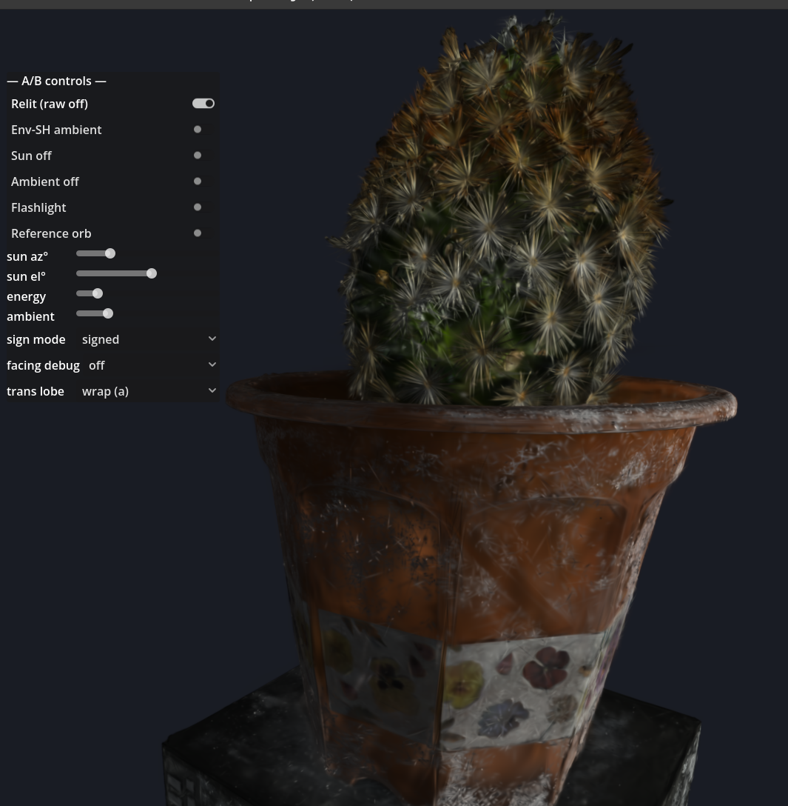
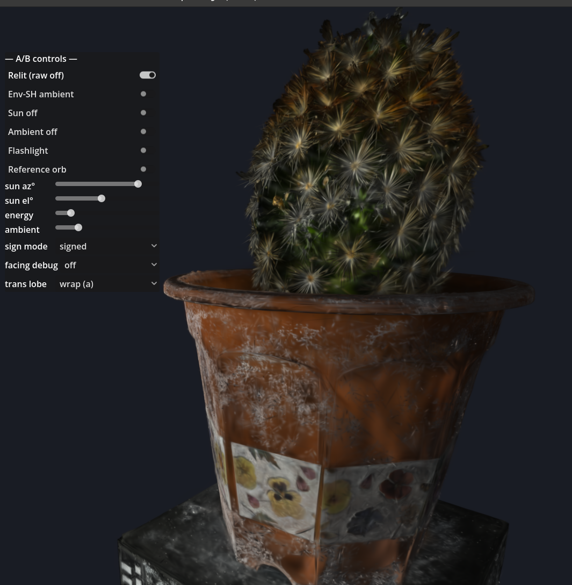
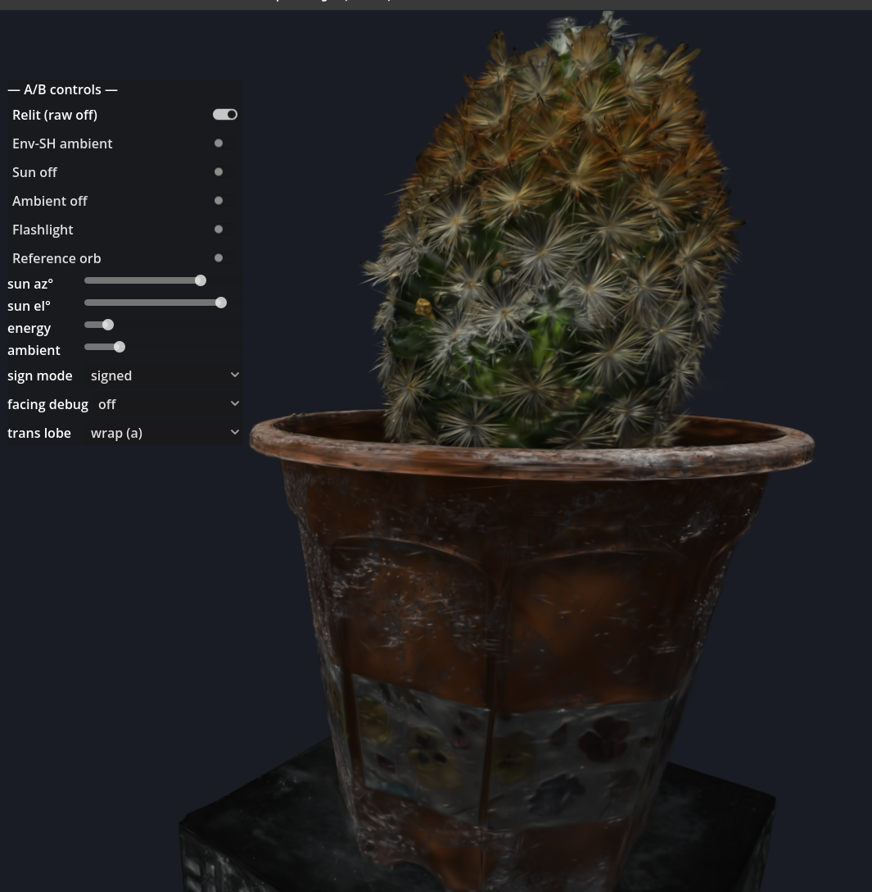
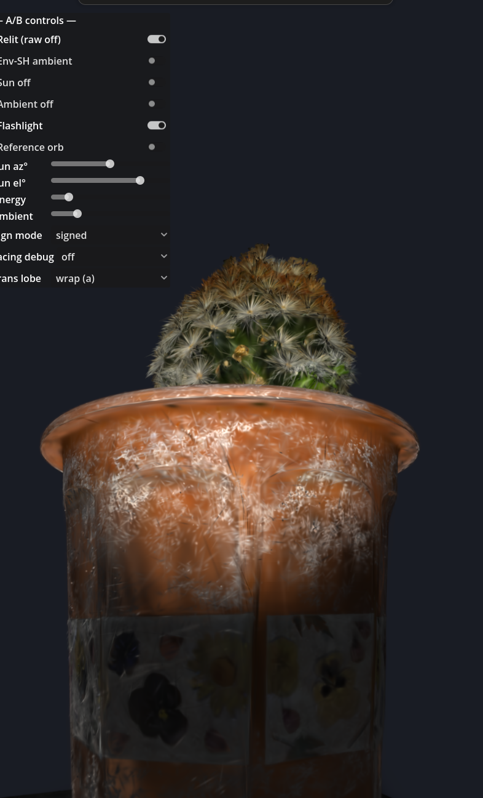
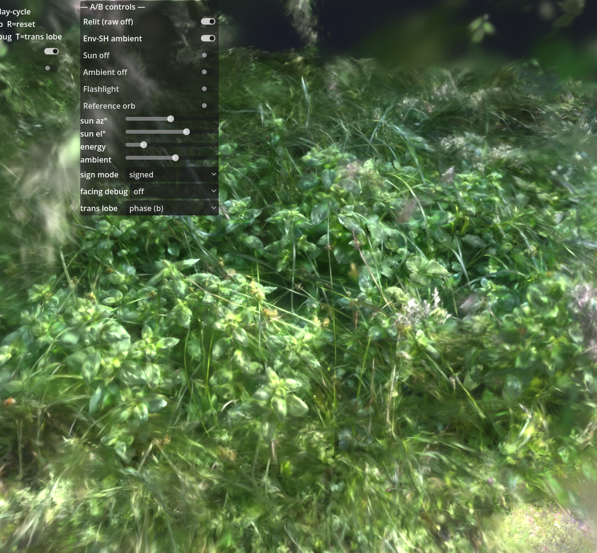
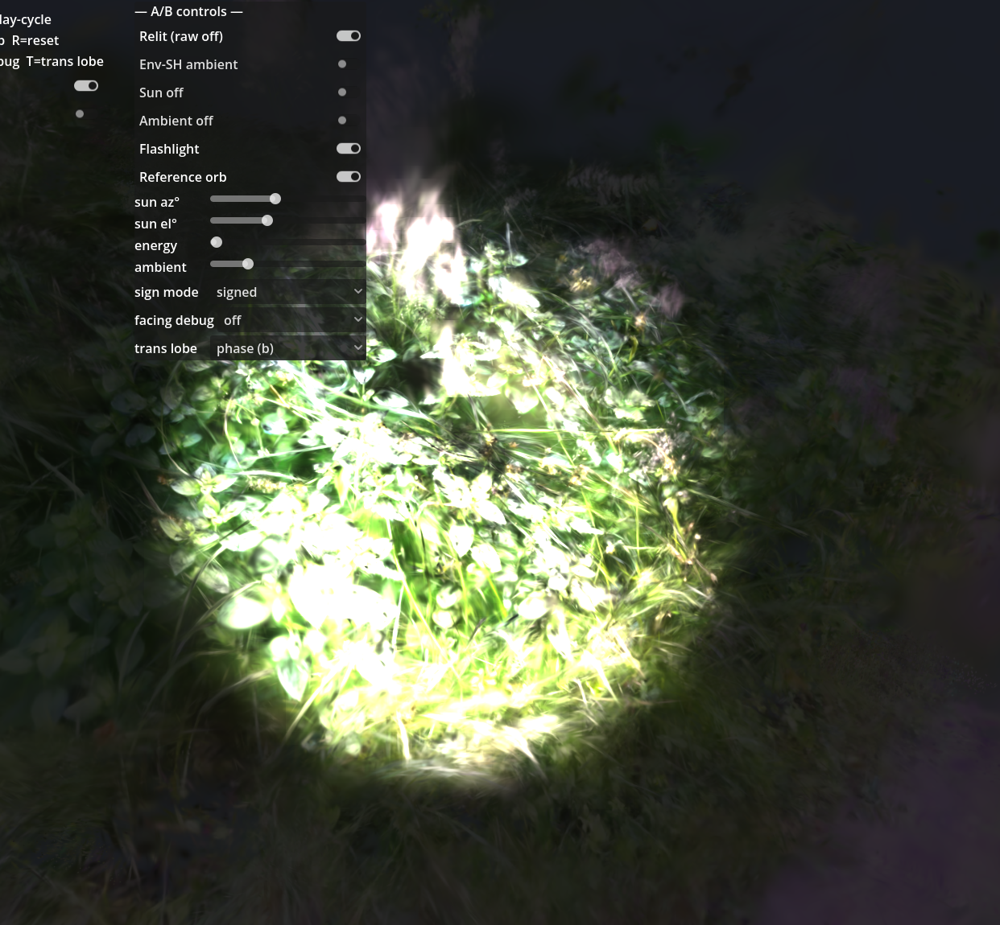
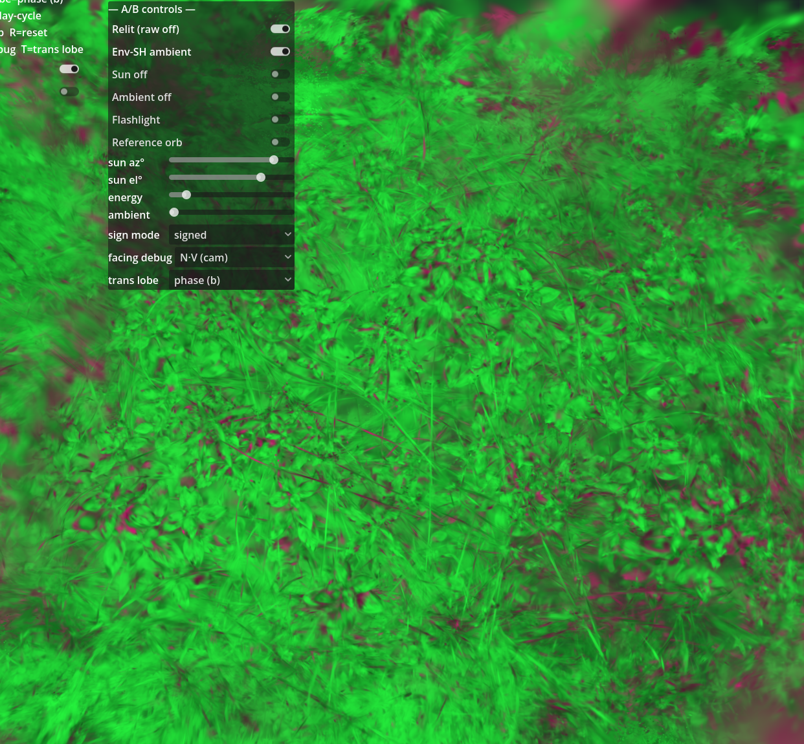
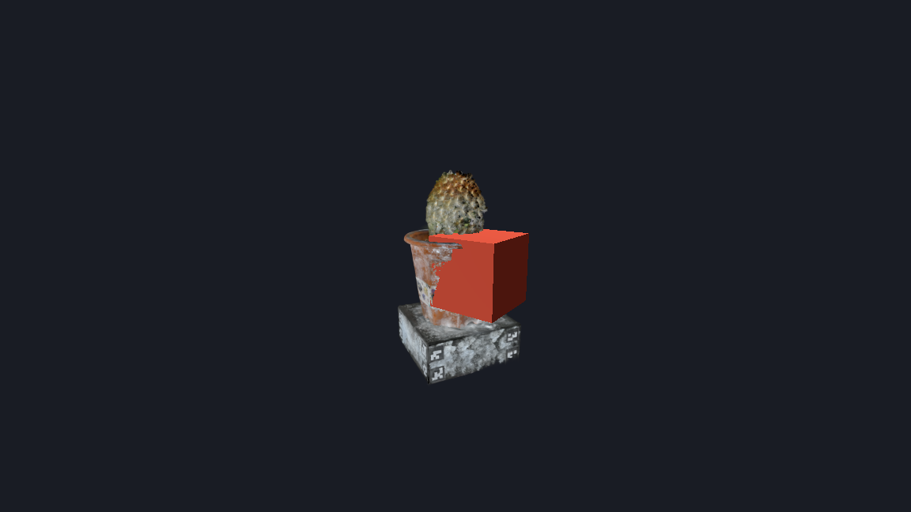

# splatworld

Relightable **Gaussian-splat foliage** tech demo in **Godot 4.7**, built from
photogrammetry, with an offline **precompute pipeline** that produces delit, labeled,
relightable splat assets.

**Thesis: intelligence at author time, cheap blend at runtime.** The precompute pipeline
decomposes baked appearance into per-Gaussian material attributes (albedo / normal /
roughness / transmission); the Godot runtime shades them per frame with a small compute
pass. **No neural networks at runtime.**

> ⚠️ **Live / under active development — a research prototype, not a polished asset
> showcase.** The shots below are the interactive relight **testing environment**; the
> on-screen A/B toggles are the sandbox controls, left visible on purpose. Asset
> reconstruction quality (foliage especially) is early — the point here is that the
> **relight / transmission / point-light mechanism works on real, imperfect
> photogrammetry**, not that the splats are clean.

## Relighting a captured splat in real time

The clearest look at the mechanism is on a clean capture — a CC0 cactus. It's the *same*
Gaussian-splat asset in every frame, relit live: the directional "sun" swept across it,
then a camera-mounted flashlight (point light). No baked lighting — the runtime shades
every Gaussian per frame from recovered albedo / normal / roughness.

| sun → | sun → | sun → | + flashlight |
|---|---|---|---|
|  |  |  |  |

## The real target: foliage from handheld footage

Foliage is the hard case and the actual research bet. Below is the author's own handheld
clip, reconstructed end to end by the pipeline. The reconstruction is **rough** —
semi-transparent green haze, no crisp leaf geometry, floaters — but it **relights,
transmits backlight, and takes a point light per-splat**. "Somewhat working on messy real
data" is exactly the bar this stage is meant to prove.

| Relit under daylight | Night + flashlight (point light + transmission glow) |
|---|---|
|  |  |

Under the hood — the per-Gaussian **normal-facing debug view** (green = front-facing,
magenta = back-facing). Resolving these signs on noisy foliage normals is an open problem;
the visible magenta speckle is that residual, not a render bug.



## Status

| | Milestone | State |
|---|---|---|
| **M0** | GDGS render path + bidirectional splat/mesh depth occlusion | ✅ |
| **M1** | precompute pipeline end to end (frames → COLMAP SfM → gsplat `train_base` → extended relightable `export`) | ✅ — 204/204 frames registered, 2.39 M gaussians, 21.7 dB held-out PSNR |
| **M2** | `decompose` — inverse rendering for per-Gaussian albedo / normal / roughness + recovered environment light | ✅ |
| **M3** | transmission — backlit grass/leaf glow + runtime toggle | ◑ code complete; milestone acceptance in progress |
| **M4** | carpet + in-engine authoring tools (instanced foliage blocks) | 🔜 designed, starting |

Runtime features, all live behind toggles today: direct relight · env-SH ambient · camera
point-light / flashlight · thin-foliage transmission. **Known open area:** foliage
reconstruction quality (noisy normals and their sign) — an active research track, not
a solved problem.



*M0: a Gaussian-splat cactus with an intersecting mesh cube, occluding correctly in both
directions — validates the render path before anything else.*

## Layout
| Path | What |
|---|---|
| `precompute/` | CLI pipeline: `core/` (schema contract, `ply_io`, `colmap_io`), `stages/` (`train_base`, `decompose`, `transmission`, `export`, …), `run.py` driver, `tests/`. See `precompute/CLAUDE.md`. |
| `godot/` | Godot demo + vendored **GDGS** renderer (`addons/gdgs/`) + our relight compute pass & tools (`relight/`). See `godot/CLAUDE.md`. |
| `docs/decisions.md` | Architecture decisions + the full environment/build recipe (CUDA/gsplat/COLMAP gotchas). |
| `tasks/`, `lore/` | Ranked work queue + decisions + session notes (apothekary layered workflow). |
| `CLAUDE.md` | Project spec, milestones, invariants. |

## Quickstart (Linux + NVIDIA GPU)
Environment is conda-forge + PyTorch cu124 (see `precompute/env.yml`); COLMAP lives in a
separate conda env; Godot 4.7 with the Forward+ backend.
```bash
# precompute (in the splat-relight env): raw frames → relightable asset
python precompute/run.py --asset <name> --stages train_base,decompose,export --gpu 0
python -m pytest precompute/tests -q

# Godot: interactive relight testing environment (real GPU)
RELIGHT_ASSET=res://gs_assets/<name>.relightply DISPLAY=:0 \
  ~/godot/godot --path godot res://scenes/viewer.tscn

# Godot data-gate smoke test (headless, no GPU)
godot --path godot --headless --script res://relight/tools/smoke_test.gd
```

## Attribution / third-party
- **GDGS** (Godot Gaussian Splatting) — vendored in `godot/addons/gdgs/` under the **MIT
  License**, © ReconWorldLab. Patched for Godot 4.7 (documented in `docs/decisions.md`).
- The "cactus" 3DGS sample asset used for the clean-geometry relight demo is CC0
  (steam-studio.jp) and is **not** redistributed in this repository.
- The foliage footage is the author's own capture.
- Project structure follows the **apothekary layered workflow** (apothekary.dev).

## License
[Apache-2.0](LICENSE).
