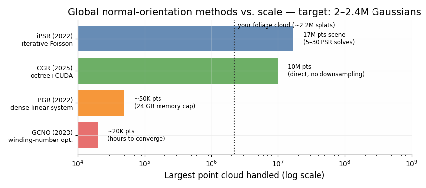
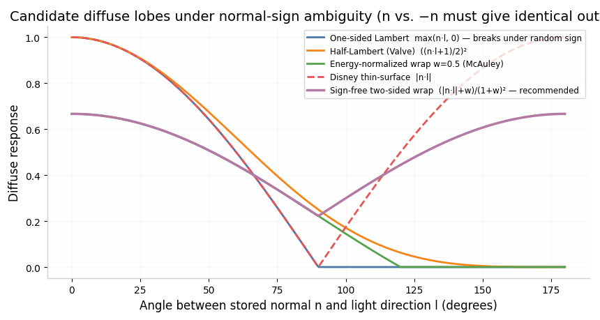

# Normal-Sign Ambiguity and Thin-Foliage Shading for Relightable Gaussian Splats

**Deep-research deliverable for DECISIONS D7 and the M3 transmission spec.**

---

## Executive Summary

**D7 verdict: make the sign irrelevant at runtime; do not pursue global sign optimization.** No published relightable-Gaussian system achieves global normal-sign consistency on thin, non-manifold geometry — every one of them either flips normals toward the camera per frame (GaussianShader, 2DGS, GIR), inherits a camera-facing sign from depth-gradient or monocular-normal supervision (GS-IR, R3DG, GI-GS, GS-ID, ReCap), or borrows an externally oriented field from an SDF (DeferredGS). The one system whose lighting is genuinely sign-invariant (LumiGauss, via the quadratic SH irradiance form **nᵀM(l)n**) is also the one built on the flattest primitives (2DGS disks) — i.e., the field is already drifting toward sign-free formulations. Meanwhile the global-orientation literature (Hoppe-MST, graph-cut, Dipole, iPSR, PGR, GCNO) assumes an underlying orientable manifold, caps out between ~20K and ~50K points for the exact solvers, and has never demonstrated foliage-class point clouds; your measured **~30% neighbor sign-opposition floor is a property of canopy geometry, not a resolver bug**.

**Recommended runtime shading (foliage splats):** a confidence-gated, two-lobe diffuse model. Use a **sign-free two-sided wrapped lobe** `saturate((|n·l| + w)/(1+w)) / (1+w)` with `w ≈ 0.3–0.5` for low-confidence splats (canopy interior), and blend toward a one-sided lobe on a **camera-oriented normal** `n_v = n·sign(n·v)` for high-confidence splats (bark, branches). Specular always uses `n_v` — specular on the camera-facing side is exactly what GaussianShader, 2DGS, and SpeedTree's "flip backside normals" all do, and it carries the directional shading cue that `|n·l|` shading sacrifices.

**Recommended M3 backlit/transmission term:** a view-relative Frostbite/UE-style term that is sign-robust by construction:

```
n_v   = n * sign(n·v)                              // camera-oriented, cheap
T     = trans * ( pow(saturate(dot(v, -(l + d*n_v))), p) * s + a ) * thickness
```

with `d ≈ 0.2–0.4` (distortion), `p ∈ [4, 12]`, and a Disney-style energy guard `trans ≤ 1 − E_diffuse`. This is Barré-Brisebois/Frostbite-2 translucency with UE's Two-Sided-Foliage scatter distribution (`D_GGX(0.36, saturate(−v·l))`) as an alternative shaping function; both depend on **v·l alignment, not on the sign of n**, and the normal enters only as a small, camera-oriented perturbation. Your planned term `trans·pow(max(dot(−N,L),0)·0.5+0.5, wrap_power)` is confirmed degenerate under `|dot|` shading — it collapses to a constant — and should be replaced, not patched.

---

## 1. What Published Relightable / Inverse-Rendering 3DGS Systems Do About Normal Sign

The survey below covers the requested systems plus the relevant 2024–2026 additions (ReCap, LumiGauss, Ref-GS, R3GW, SU-RGS, RGS-DR). The central finding is that **normal sign in this literature is never resolved globally**; it is resolved *per view*, inherited from camera-facing supervision, or sidestepped by sign-free lighting. The systems cluster into four mechanisms, tabulated first and then detailed.

| System | Normal source | Sign mechanism (exact) | Class |
|---|---|---|---|
| GaussianShader (CVPR'24) | Shortest covariance axis + learnable residual | **Per-view two-branch selection**: `n = v+Δn₁ if ω₀·v>0 else −(v+Δn₂)` — two residuals trained, one per orientation  [(CVF Open Access)](https://openaccess.thecvf.com/content/CVPR2024/papers/Jiang_GaussianShader_3D_Gaussian_Splatting_with_Shading_Functions_for_Reflective_Surfaces_CVPR_2024_paper.pdf)  | Per-frame camera flip |
| GIR (TPAMI'25) | Shortest eigenvector | **Front-face culling mask** `M = 0 if n·v ≤ 0` in alpha blending; back-facing Gaussians receive no color gradient, plus a regularizer keeping the shortest axis at an **obtuse angle to the camera principal axis** ("directional masking")  [(arXiv.org)](https://arxiv.org/html/2312.05133v1)  | Per-frame camera flip |
| 2DGS (SIGGRAPH'24) | Ray–splat intersection plane | Normal "oriented towards the camera" each frame; depth-normal consistency loss  [(KITTI)](https://www.cvlibs.net/publications/Huang2024SIGGRAPH.pdf)  | Per-frame camera flip |
| GS-IR (CVPR'24) | Stored per-Gaussian normal | Depth-gradient pseudo-normal supervision + TV smoothness; **no explicit sign handling** — sign is whatever the view-facing depth gradient implies  [(CVF Open Access)](https://openaccess.thecvf.com/content/CVPR2024/papers/Liang_GS-IR_3D_Gaussian_Splatting_for_Inverse_Rendering_CVPR_2024_paper.pdf)  | Implicit camera-facing |
| R3DG (ECCV'24) | Assigned per-point normal | `L_n = ‖N − Ñ‖₂` against pseudo-normal from rendered depth under local planarity; no sign handling beyond that  [(ECVA)](https://www.ecva.net/papers/eccv_2024/papers_ECCV/papers/06121.pdf)  | Implicit camera-facing |
| GI-GS (ICLR'25) | Per-Gaussian normal attribute | Pseudo-normals derived from the depth map; deferred G-buffer shading  [(example)](https://proceedings.iclr.cc/paper_files/paper/2025/file/bc97207e3979d1cc23109db0be0e8ed2-Paper-Conference.pdf)  | Implicit camera-facing |
| GS-ID (ICCV'25) | 2DGS + priors | Normal priors from Omnidata/diffusion monocular estimators — **camera-facing by construction**  [(arXiv.org)](https://arxiv.org/html/2408.08524v1)  | Implicit camera-facing |
| ReCap (2024) | Shortest axis only | Depth-derived normal consistency loss; deliberately *no* learnable residual (residuals bake highlights into geometry)  [(arXiv.org)](https://arxiv.org/html/2412.07534v2)  | Implicit camera-facing |
| R3GW (2026) | Per-Gaussian normal | `Σ αᵢ(1 − nᵢᵀN)` against depth-gradient reference + flattening loss on min scale  [(scitepress.org)](https://www.scitepress.org/publishedPapers/2026/143322/pdf/index.html)  | Implicit camera-facing |
| DeferredGS (TPAMI'25) | Distilled normal field | Normal **distilled from a jointly trained NeuS SDF** — sign resolved by the SDF's outward gradient  [(arXiv.org)](https://arxiv.org/abs/2404.09412)  | External oriented field |
| LumiGauss (WACV'25) | 2DGS disk normal | **Sign-free lighting**: irradiance as quadratic SH form `c_k = ρ_k ⊙ n_kᵀ M(l_k) n_k`, invariant under `n → −n`  [(arXiv.org)](https://arxiv.org/html/2408.04474v2)  | Sign-free formulation |
| IRGS (CVPR'25) | 2DGS disk normal | 2D Gaussian ray tracing; normals from well-defined ray–disk intersection  [(arXiv.org)](https://arxiv.org/abs/2412.15867)  | Per-frame camera flip (2DGS) |
| Ref-GS (CVPR'25) | 2DGS geometry pass | Deferred shading: blend attributes first, shade per-pixel — explicitly motivated by the **"orientation–viewing ambiguity"** of per-primitive directional queries  [(arXiv.org)](https://arxiv.org/html/2412.00905v1)  | Deferred/sign-sidestep |

Three observations matter for D7. First, the two most-cited "solutions" are both **per-frame viewer-relative flips**: GaussianShader trains *two* normal residuals and picks the branch facing the current view (`n = v+Δn₁ if ω₀·v>0, else −(v+Δn₂)`)  [(CVF Open Access)](https://openaccess.thecvf.com/content/CVPR2024/papers/Jiang_GaussianShader_3D_Gaussian_Splatting_with_Shading_Functions_for_Reflective_Surfaces_CVPR_2024_paper.pdf) , and GIR multiplies a binary visibility mask `M = {0 if n·v ≤ 0, 1 otherwise}` into the alpha-blending weight so that back-facing Gaussians simply do not contribute color and are progressively re-oriented by the photometric gradient  [(arXiv.org)](https://arxiv.org/html/2312.05133v1) . Both are legitimate for closed objects seen from outside, and both produce exactly the patchy, view-dependent sign field you observe when the primitive cloud is an interleaved volume of leaves rather than a manifold: under a *relighting* camera path the sign of each splat flips as the view crosses its plane, and any sign baked into a stored residual becomes wrong for half the orbit.

Second, the "implicit camera-facing" class (GS-IR, R3DG, GI-GS, GS-ID, ReCap, R3GW) never treats sign as a variable at all. The stored normal is supervised against a **depth-gradient pseudo-normal**, which by construction faces the rendering camera; the sign the splat retains is therefore an accident of whichever training views dominated its gradients  [(CVF Open Access)](https://openaccess.thecvf.com/content/CVPR2024/papers/Liang_GS-IR_3D_Gaussian_Splatting_for_Inverse_Rendering_CVPR_2024_paper.pdf) . This is consistent with your measurement that three different camera-based resolvers all hit the same ~30% floor — camera-relative evidence cannot fix an orientation that is fundamentally a per-pixel, per-view quantity on foliage. DeferredGS is the only system with a *globally* oriented normal, and it gets it for free from a NeuS SDF distilled into the Gaussians  [(arXiv.org)](https://arxiv.org/abs/2404.09412)  — an option that presupposes a closed, watertight surface and is not available for canopy geometry.

Third, LumiGauss is the outlier that points the way: its relighting uses the closed-form SH irradiance `c_k = ρ_k ⊙ n_kᵀ M(l_k) n_k`, a **quadratic form in n that is exactly invariant to sign flips**  [(arXiv.org)](https://arxiv.org/html/2408.04474v2) . It can afford this because its primitives are 2DGS disks whose normals are smooth and view-stable, and because diffuse-only relighting under environment lighting tolerates the loss of front/back asymmetry. For foliage — where front and back of a leaf genuinely differ mainly in *transmission*, not in diffuse reflection — this is the mathematically correct precedent: the part of the model that must know the sign (the backlit BTDF) should get it from the **light–view configuration**, not from the stored normal.

## 2. Two-Sided / Foliage Shading Practice in Real-Time Engines

Real-time engines have solved the "thin leaf with unreliable normal" problem for two decades, and their solutions are uniform in structure: **(a)** resolve the normal toward the viewer at rasterization time, **(b)** shade diffuse with a two-lobe or wrapped response, **(c)** put the directional backlight cue in a view-relative transmission term, and **(d)** normalize for energy. The exact formulas below are production code, not approximations of it.

**Unreal Engine — Two Sided Foliage shading model.** The engine's documented foliage model exists precisely because "using the Default Lit shading model for foliage can lead to incorrect looking results… almost black on the underside surfaces because it does not simulate any sort of light transmission"  [(Epic Dev)](https://dev.epicgames.com/documentation/unreal-engine/shading-models-in-unreal-engine) . The decompiled BxDF is  [(tistory.com)](https://prooveyourself.tistory.com/46) :

```cpp
FDirectLighting Lighting = DefaultLitBxDF(GBuffer, N, V, L, Falloff, NoL, ...);  // front: standard GGX+Lambert
half Wrap    = 0.5;
half WrapNoL = saturate( (-dot(N,L) + Wrap) / Square(1+Wrap) );   // wrapped BACK lobe (McAuley-normalized)
half VoL     = dot(V, L);
half Scatter = D_GGX( 0.6*0.6, saturate(-VoL) );                  // view-light alignment, N-FREE
Lighting.Transmission = Falloff * WrapNoL * Scatter * SubsurfaceColor;
```

Two details are directly relevant to M3. The transmission strength is the product of a *back-lobe* term and a **scatter term that contains no normal at all** — `saturate(−v·l)` fed through a GGX distribution with fixed roughness 0.6 produces the bright halo when the camera looks toward the light through the leaf  [(tistory.com)](https://prooveyourself.tistory.com/46) . And the model is only well-defined because UE's two-sided rasterization **flips the backface normal toward the viewer** before shading; practitioners working with leaf *cards* (where the card normal is a canopy average, not a leaf normal) explicitly multiply the normal by the `TwoSidedSign` node to *prevent* the flip, because "a SpeedTree's leaves are usually a representation of a cloud of leaves, so you don't want the normal to flip"  [(Epic Developer Community Forums)](https://forums.unrealengine.com/t/twosided-foliage-shading-model/298609) .

**SpeedTree.** The middleware ships both strategies and documents when each breaks. With "flip backside normals" on, face normals give the best specular up close and artists orient cluster faces outward from the trunk; with it off (the TwoSidedSign path), artists push normals "puffy" — up and out of the canopy — accepting a flatter look in exchange for never seeing a wrongly-signed leaf  [(Unity Discussions)](https://discussions.unity.com/t/implementing-smooth-lighting-of-speedtree-in-unreal-engine-5/1534616) . The same source warns that pushing normal variation past ~0.5 makes normals "flip around to the back side, [producing] extra dark pockets in the maps where no light is able to render"  [(Unity Discussions)](https://discussions.unity.com/t/implementing-smooth-lighting-of-speedtree-in-unreal-engine-5/1534616)  — a direct analogue of your patchy fake shadows. The classic GPU Gems 3 implementation adds the two-sided *color* logic: when the angle μ between light and view approaches π (camera looking at the sun through the tree), leaf color is lerped toward a yellow-shifted transmitted tint `(G·0.9, G·1.0, G·0.2)` and "the specular component is reduced, because no light reflection should occur on the back side"  [(NVIDIA Developer)](https://developer.nvidia.com/gpugems/gpugems3/part-i-geometry/chapter-4-next-generation-speedtree-rendering) .

**Frostbite / DICE.** The canonical Frostbite-family translucency is Barré-Brisebois & Bouchard's GDC 2011 approximation, shipped in Frostbite 2 and published in GPU Pro 2  [(colinbarrebrisebois.com)](https://colinbarrebrisebois.com/wp-content/uploads/2022/06/gdc2011-approximatingtranslucency-1.pdf) :

```cpp
half3 vLTLight = vLight + vNormal * fLTDistortion;                       // d ≈ 0.2 typical
half  fLTDot   = pow( saturate(dot(vEye, -vLTLight)), iLTPower ) * fLTScale;   // power 4–12
half3 fLT      = fLightAttenuation * (fLTDot + fLTAmbient) * fLTThickness;
outColor.rgb  += cDiffuseAlbedo * cLightDiffuse * fLT;
```

The entire directional content is `dot(v, −(l + d·n))`: light-behind-leaf alignment between view and light, with the normal entering only as a small distortion term that "simulates subsurface light transport distortion… almost Fresnel-like at times"  [(colinbarrebrisebois.com)](https://colinbarrebrisebois.com/wp-content/uploads/2022/06/gdc2011-approximatingtranslucency-1.pdf) . Thickness comes from ambient occlusion computed with inverted normals — a trick your inverse-rendering stage can replace with the splat's own `s_min` (shortest-axis thickness) or the baked visibility field. The authors' stated caveat list — "doesn't take all concavities into account… optimal for convex hulls"  [(colinbarrebrisebois.com)](https://colinbarrebrisebois.com/wp-content/uploads/2022/06/gdc2011-approximatingtranslucency-1.pdf)  — is much less damaging for leaves, which are locally convex thin slabs.

**Film practice (Disney/Pixar).** Disney's production BSDF formalizes the "thin" material class used for "leaves and other foliage modeled without an interior volume": enter and exit scattering events are evaluated at a single shading point, subsurface is approximated with the Hanrahan–Krueger diffuse model, and — critically for D7 — the implementation evaluates diffuse response with **`AbsCosTheta` on both light and view directions**, i.e., `|n·l|`  [(schuttejoe.github.io)](https://schuttejoe.github.io/post/disneybsdf/) . Energy plausibility is handled by **transfer, not addition**: the `diffTrans` parameter "transfers energy from the diffuse reflection lobe to the diffuse transmission lobe; a value of 1 makes the front and back lobes equal, and the value can be increased up to 2 to give all the energy to transmission"  [(selfshadow.com)](https://blog.selfshadow.com/publications/s2015-shading-course/burley/s2015_pbs_disney_bsdf_notes.pdf) . The thin-surface diffuse transmission itself is "an isotropic lobe… justified by the assumption that transmission due to subsurface scattering is isotropic"  [(selfshadow.com)](https://blog.selfshadow.com/publications/s2015-shading-course/burley/s2015_pbs_disney_bsdf_notes.pdf) . Physically grounded leaf models (Wang et al.'s LEAFMOD slab; Habel et al.'s real-time multi-pole leaf translucency) reach the same structural conclusion: the leaf BTDF is diffuse-only, `f_t = ρ_t/π`, parameterized by thickness and the tissue's scattering/absorption coefficients, with front and back surfaces allowed different albedos  [(Computer Graphics Group)](https://graphics.cs.yale.edu/sites/default/files/leaf2005.pdf) .

**Energy plausibility and known failure modes.** Wrapped diffuse without normalization is not energy-conserving; McAuley's correction divides by the analytic integral of the wrapped hemisphere, which for full wrap `w=1` halves the brightness, and UE's `(1+w)²` denominator in `WrapNoL` is the clamped version of the same idea  [(Source)](https://diffuse133.rssing.com/chan-36853166/article2.html) . Valve's Half-Lambert — `((n·l)·0.5 + 0.5)²` used "since Half-Life in 1998" — is the cheap, non-normalized alternative that "prevent[s] characters from losing all sense of shape on the back side"  [(steamstatic.com)](https://cdn.fastly.steamstatic.com/apps/valve/2008/GDC2008_StylizationWithAPurpose_TF2.pdf) . As for when two-sided shading visibly breaks: (i) **flatness** — discarding the normal entirely (constant or pure `|n·l|` with no wrap slope) removes the shading gradient and "looks entirely too flat… you are treating the interaction of light as if every face on the tree is facing the sun directly"  [(Unity Discussions)](https://discussions.unity.com/t/consistent-lighting-for-double-sided-shader-foliage/691712) ; (ii) **loss of self-shadowing on backfaces** — "a leaf isn't going to self shadow its backface," so back-lit quads read as glowing unless attenuated by the shadow/visibility term  [(Unity Discussions)](https://discussions.unity.com/t/consistent-lighting-for-double-sided-shader-foliage/691712) ; (iii) **thick, hard side-lit geometry (bark, branches)** — two-sided response doubles the lit area of a cylinder and destroys its occluding-side terminator, which is why engines keep trunks on Default Lit and why your renderer should keep a signed one-sided path for high-confidence splats; (iv) **dark pockets** from normals pushed past the hemisphere  [(Unity Discussions)](https://discussions.unity.com/t/implementing-smooth-lighting-of-speedtree-in-unreal-engine-5/1534616) . All four failure modes argue for the *gated blend* recommended in Section 6 rather than a uniform two-sided model.

## 3. A Backlit / Transmission Term Compatible with Sign-Agnostic Normals

Your planned term, `trans · pow(max(dot(−N,L),0)·0.5 + 0.5, wrap_power)`, mixes a back-lobe selector (`max(−n·l,0)`) with a wrap remap. Under `|dot|` shading the selector's information content is destroyed: `|n·l|` cannot distinguish "light in front of the stored normal" from "light behind it," so front and back receive identical transmission — the degeneracy you flagged is real, and it is intrinsic to using the stored sign at all. The fix used across the literature is to source the front/back distinction from the **view–light configuration**, which is sign-free, rather than from the normal. Three production-proven formulations, in increasing order of physical fidelity:

**Option A — Frostbite distortion term (recommended for M3).** `T = trans · ( pow(saturate(dot(v, −(l + d·n_v))), p) · s + a ) · thickness`, with `n_v = n·sign(n·v)`  [(colinbarrebrisebois.com)](https://colinbarrebrisebois.com/wp-content/uploads/2022/06/gdc2011-approximatingtranslucency-1.pdf) . The dominant factor is `dot(v,−l)`: it peaks when the camera looks into the light through the leaf, regardless of the splat's sign. The distortion `d·n_v` tilts the lobe by the leaf orientation; because `n_v` is camera-oriented, the term is continuous under viewpoint motion and identical for `n` and `−n`. Cost: ~13 shader instructions in the original 7th-gen-console implementation  [(colinbarrebrisebois.com)](https://colinbarrebrisebois.com/wp-content/uploads/2022/06/gdc2011-approximatingtranslucency-1.pdf) .

**Option B — UE Two-Sided-Foliage decomposition.** `Transmission = WrapNoL · Scatter · SubsurfaceColor`, where `WrapNoL = saturate((−dot(n_v,l) + 0.5)/2.25)` and `Scatter = D_GGX(0.36, saturate(−v·l))`  [(tistory.com)](https://prooveyourself.tistory.com/46) . Compute the `WrapNoL` factor against the **camera-oriented** normal `n_v`; this is exactly what UE's two-sided normal flip provides, and it keeps a (weak) normal dependence for artists while the scatter halo remains N-free. This is the better choice if you want separate control of "how back-lit is this splat" (WrapNoL) and "how aligned are view and light" (Scatter), e.g. to drive them from two different learned attributes.

**Option C — Physically parameterized thin slab.** If the transmission milestone later needs measurable parameters, adopt the Wang/Habel slab structure: isotropic BTDF lobe `ρ_t/π` modulated by thickness attenuation `exp(−(σ_a+σ_s)·h/cosθ_t)`, with front/back albedo asymmetry allowed  [(Computer Graphics Group)](https://graphics.cs.yale.edu/sites/default/files/leaf2005.pdf) . Disney's production simplification of the same physics is to keep the lobe isotropic and let `diffTrans` partition energy between reflection and transmission  [(selfshadow.com)](https://blog.selfshadow.com/publications/s2015-shading-course/burley/s2015_pbs_disney_bsdf_notes.pdf) . The sign never appears in any of these because a thin slab's BTDF is defined symmetrically about the slab plane.

For all three options, two guards keep energy plausible: normalize any wrapped component à la McAuley (`/(1+w)` family)  [(Source)](https://diffuse133.rssing.com/chan-36853166/article2.html) , and treat `trans` as an energy *transfer* from the diffuse lobe (`diffuse *= (1 − trans·k)`) rather than a pure addition, per the Disney `diffTrans` convention  [(selfshadow.com)](https://blog.selfshadow.com/publications/s2015-shading-course/burley/s2015_pbs_disney_bsdf_notes.pdf) . The transmission term must also be multiplied by your baked light-visibility/shadow term — otherwise unshadowed back-lit splats inside the canopy glow, the splat analogue of the "leaf doesn't self-shadow its backface" artifact  [(Unity Discussions)](https://discussions.unity.com/t/consistent-lighting-for-double-sided-shader-foliage/691712) .

## 4. Is <5% Neighbor Sign-Opposition Achievable on Vegetation Point/Splat Clouds?

**Short answer: no — not at 2–2.4M points, not on foliage, and the target itself is mis-specified for canopy geometry.** The global-orientation literature is deep and genuinely impressive, but every family either assumes a manifold surface, fails to reach your scale, or both.

**Propagation methods (Hoppe-MST and descendants).** Hoppe et al. 1992 formulated consistent orientation as maximizing `Σ w_ij·Φ_i·Φ_j` over sign assignments `Φ ∈ {±1}` on a Riemannian k-NN graph with edge weights `1 − |n_i·n_j|` — explicitly NP-hard — and approximated it by MST traversal, flipping `n_j → −n_j` whenever `n_i·n_j < 0`  [(Department of Computer Science)](https://www.cs.jhu.edu/~misha/Fall13b/Notes/Hoppe92.notes.pdf) . The known failure mode is catastrophic and exactly matches your setting: a single wrong edge flips an **entire subtree**, which is why later work calls MST propagation "highly efficient but prone to errors, often flipping entire subtrees, especially in sparse data"  [(arXiv.org)](https://arxiv.org/html/2505.23469v1) . In a canopy, the k-NN graph is dominated by *inter-leaf* edges (points on different leaves centimeters apart), where sign agreement is not even desirable — the optimization target is wrong, not just hard.

**Graph-cut / MRF methods.** Schertler et al. reformulated Hoppe's energy as maximum-likelihood on an MRF solved with QPBO and added streaming for out-of-core scale  [(uni-bonn.de)](https://cg.cs.uni-bonn.de/backend/v2/files/publications/ochmann-2019-automatic/pdf/Ochmann_2019_Orientation_f2466273c6.pdf) ; these methods improve robustness on closed scans but inherit the same objective — they maximize *local* sign agreement subject to a global prior, and on thin-walled or nearby-parallel structures they are documented to break  [(xrvitd.github.io)](https://xrvitd.github.io/Projects/GCNO/index.html) . GCNO (SIGGRAPH 2023 best paper) gets the best reported quality on "sparse and noisy point clouds, as well as shapes with complex geometry/topology" by regularizing the **winding-number field** at Voronoi vertices  [(xrvitd.github.io)](https://xrvitd.github.io/Projects/GCNO/index.html)  — but the winding number is only meaningful for (nearly) closed surfaces, and its cost is hours on a 20K-point cloud  [(ACM Digital Library)](https://dl.acm.org/doi/10.1145/3750723) .

**Implicit / iterative methods.** iPSR eliminates the orientation stage by iterating Poisson reconstruction: reconstruct → read normals off the current iso-surface → repeat, converging in **5–30 iterations** (average ~10), accelerated ~45% by a visibility-based initialization, and demonstrated on a 17M-point indoor scene  [(arXiv.org)](https://arxiv.org/abs/2209.09510) . This is the only classical method that provably reaches your scale — but each iteration is a full screened-Poisson solve (the paper reports ~1.2 hours at 5 iterations on one model  [(arXiv.org)](https://arxiv.org/pdf/2209.09510) ), the output is **watertight by construction**, and subsequent benchmarking notes it "struggles with thin structures"  [(CVF Open Access)](https://openaccess.thecvf.com/content/CVPR2025/papers/Fu_Consistent_Normal_Orientation_for_3D_Point_Clouds_via_Least_Squares_CVPR_2025_paper.pdf) ; foliage is nothing but thin structures, and a watertight prior will happily bridge and close inter-leaf gaps, manufacturing the wrong orientations with high confidence. PGR (parametric Gauss reconstruction) is robust on thin sheets but solves a **dense** linear system — hard-capped at ~50K points in 24 GB  [(ACM Digital Library)](https://dl.acm.org/doi/10.1145/3750723) . The 2025 successor CGR restores scalability (10M points, octree+CUDA, O(N log N))  [(ACM Digital Library)](https://dl.acm.org/doi/10.1145/3750723) , and the 2025 least-squares sign-field-on-Delaunay method similarly targets "dense" clouds  [(CVF Open Access)](https://openaccess.thecvf.com/content/CVPR2025/papers/Fu_Consistent_Normal_Orientation_for_3D_Point_Clouds_via_Least_Squares_CVPR_2025_paper.pdf)  — yet both remain *surface-reconstruction* methods whose notion of "correct" orientation presumes an orientable 2-manifold enclosing a volume. Dipole propagation (learned per-patch coherence + global double-layer field) is robust to noise but its "patch partition strategy may affect the robustness… especially on thin structures"  [(ORCA)](https://orca.cardiff.ac.uk/id/eprint/159075/1/paper.pdf) . Learned direct orientation (PCPNet-style) is empirically *worse* than estimating unoriented normals and orienting afterward  [(arXiv.org)](https://arxiv.org/html/2210.02757v3) .



**Why the <5% target is the wrong metric for foliage.** Every method above defines success as agreement with an oriented ground-truth manifold. A foliage splat cloud is not a sampling of one surface; it is a volumetric aggregation of thousands of quasi-planar leaves whose normal fields interpenetrate. Neighboring splats on two adjacent leaves *should* frequently oppose — the ~30% 8-NN sign-opposition you measure is the geometric truth of a canopy, and the invariance of that floor across three different camera-based resolvers is the empirical signature of the ill-posedness, consistent with the survey finding that no relightable-GS system even attempts global orientation on this class of geometry (Section 1). Nothing in the literature demonstrates sub-5% neighbor opposition on vegetation-class clouds at any scale, let alone millions of points; the demonstrated thin-structure results (GCNO, PGR, CGR) are on CAD-like and scanned-object benchmarks at 10K–500K points, with runtimes from hours to a day  [(xrvitd.github.io)](https://xrvitd.github.io/Projects/GCNO/index.html) . The achievable, literature-supported goal is not a consistent sign field but a **shading model that is invariant to the sign field you have**.

## 5. Per-Splat Normal-Confidence Measures for Gating Shading Models

Published per-point confidence machinery exists in three neighboring literatures, and all three map cleanly onto splat attributes you already have. None of the relightable-GS papers gates shading by confidence per point (they gate *losses* globally), so this is the one place where the recommendation extends beyond direct precedent — but each ingredient is standard.

**Covariance / eigenvalue structure (strongest prior).** The point-cloud analysis literature defines a canonical feature family from sorted neighborhood eigenvalues: planarity `(λ₂−λ₃)/λ₁`, linearity `(λ₁−λ₂)/λ₁`, sphericity `λ₃/λ₁`, anisotropy `(λ₁−λ₃)/λ₁`, surface variation `λ₃/(λ₁+λ₂+λ₃)`, eigenentropy  [(d-nb.info)](https://d-nb.info/1145337546/34) . Surface variation in particular "yields an estimate of the local noise level… zero if all neighbor points perfectly fit a plane"  [(ScienceDirect)](https://www.sciencedirect.com/topics/computer-science/point-cloud-analysis)  — i.e., it *is* a normal-confidence measure, used as such in classification pipelines. LiDAR studies consistently report vegetation as the **low-planarity, high-sphericity** class versus buildings/terrain  [(CTU Open Journal Systems)](https://ojs.cvut.cz/ojs/index.php/cej/article/download/10190/version/7432/7355/44009) , which validates the axis you'll gate on. For a splat cloud you don't even need k-NN PCA: the Gaussian's own scales give a free per-splat proxy — `planarity_proxy = 1 − s_mid/s_max` and `flatness = s_min/s_max` — where a small `s_min/s_max` means a well-defined surface-like disk (trustworthy normal direction, though not sign) and a round splat means volumetric filler (untrustworthy normal). Note these predict confidence in the normal's *direction*, and your three failed resolvers supply the complementary signal for its *sign*.

**Multi-view visibility agreement.** Your camera-based resolvers (dominant-hemisphere, k-nearest-camera vote, visibility-weighted witness) each produce a sign estimate per splat; the **disagreement rate across resolvers, or the vote entropy within one resolver, is a ready-made confidence** — a splat seen from 12 cameras that split 6/6 on sign has an unknowable sign and should be shaded sign-free, while a 11/1 splat on bark deserves its sign. This has classical precedent: Katz et al.'s visibility heuristic, used to *initialize* iPSR with a 45% iteration reduction, is exactly a multi-view visibility-agreement orientation prior  [(arXiv.org)](https://arxiv.org/pdf/2209.09510) . A second cheap signal is the per-view **depth-normal residual** (the `L_n`/`L_dn` losses of GS-IR/R3DG/ReCap evaluated per splat rather than per image  [(CVF Open Access)](https://openaccess.thecvf.com/content/CVPR2024/papers/Liang_GS-IR_3D_Gaussian_Splatting_for_Inverse_Rendering_CVPR_2024_paper.pdf) ): a persistently high residual means the splat's normal never agreed with any view's depth gradient — low confidence.

**Learned/Bayesian uncertainty.** If you want a calibrated per-Gaussian posterior rather than a heuristic, Variational Bayes GS treats every attribute as a random variable with a Normal-Inverse-Wishart posterior, giving closed-form per-Gaussian parameter uncertainty  [(VERSES)](https://www.verses.ai/research-blog/variational-bayes-gaussian-splatting-a-bayesian-approach-for-continual-3d-learning) ; rendering-aware Bayesian 3DGS reports per-pixel predictive uncertainty correlating with reconstruction difficulty at Spearman ρ ≈ 0.73–0.90  [(arXiv.org)](https://arxiv.org/html/2607.05522v1) . This is heavier than needed for a runtime gate, but worth citing if the confidence must also drive the *offline* inverse-rendering loss weights.

**Recommended composite gate.** `c = w₁·planarity_proxy + w₂·vote_agreement + w₃·(1 − residual_norm)`, clamped to [0,1], then `shading = mix(two_sided_signfree, one_sided_signed, c)` per Section 6. The asymmetry to respect: direction-confidence (planarity) and sign-confidence (vote agreement) are independent axes — a bark splat can have a razor-sharp plane and a hopeless sign, in which case the correct model is one-sided-in-direction but camera-oriented-in-sign, which is precisely GaussianShader's per-frame branch  [(CVF Open Access)](https://openaccess.thecvf.com/content/CVPR2024/papers/Jiang_GaussianShader_3D_Gaussian_Splatting_with_Shading_Functions_for_Reflective_Surfaces_CVPR_2024_paper.pdf) .

## 6. Recommended Runtime Shading Formulation (D7)

Assembling Sections 1–5, the recommended model for relit foliage splats is a **confidence-gated two-lobe system with a camera-oriented normal for all signed terms**. Pseudocode:

```hlsl
// ---- per splat, per frame ----
vec3  n   = splat.normal;                      // sign-ambiguous, direction OK
vec3  n_v = n * sign(dot(n, v));               // camera-oriented (GaussianShader  [(CVF Open Access)](https://openaccess.thecvf.com/content/CVPR2024/papers/Jiang_GaussianShader_3D_Gaussian_Splatting_with_Shading_Functions_for_Reflective_Surfaces_CVPR_2024_paper.pdf)  / 2DGS  [(KITTI)](https://www.cvlibs.net/publications/Huang2024SIGGRAPH.pdf)  convention)
float ndl   = dot(n, l);
float c     = splat.confidence;                // Section 5 gate, [0,1]

// ---- diffuse direct: two-lobe blend ----
float front    = saturate(dot(n_v, l));                          // signed lobe, camera-oriented
float twoSided = saturate((abs(ndl) + w)/(1.0 + w)) / (1.0 + w); // sign-free wrap, w≈0.3–0.5, energy-normalized  [(Source)](https://diffuse133.rssing.com/chan-36853166/article2.html) 
float E_diff   = mix(twoSided, front, c);
vec3  diffuse  = albedo/PI * E_diff * L_vis;                     // L_vis: baked visibility/shadow

// ---- specular: always camera-oriented normal ----
vec3  h    = normalize(v + l);
float spec = D_GGX(roughness, dot(n_v, h)) * F(dot(h, v)) * G(...) ;  // SpeedTree: reduce spec on back side  [(NVIDIA Developer)](https://developer.nvidia.com/gpugems/gpugems3/part-i-geometry/chapter-4-next-generation-speedtree-rendering) 

// ---- transmission (M3, Section 3, Option A) ----
vec3  lt = -(l + d * n_v);                                       // d≈0.2–0.4 distortion  [(colinbarrebrisebois.com)](https://colinbarrebrisebois.com/wp-content/uploads/2022/06/gdc2011-approximatingtranslucency-1.pdf) 
float T  = trans * (pow(saturate(dot(v, -lt)), p) * s + a) * thickness * L_vis_back;

// ---- energy guard: transmission draws from diffuse (Disney diffTrans  [(selfshadow.com)](https://blog.selfshadow.com/publications/s2015-shading-course/burley/s2015_pbs_disney_bsdf_notes.pdf) ) ----
diffuse *= (1.0 - trans);
vec3 color = diffuse + spec + transColor * T;
```



Design rationale in brief. The two-sided wrapped lobe keeps a **shading gradient** (unlike pure `|n·l|`, whose V-shape flattens form  [(Unity Discussions)](https://discussions.unity.com/t/consistent-lighting-for-double-sided-shader-foliage/691712) ) while being provably identical under `n → −n`; the wrap `w` is your artist control for canopy translucency ambience. The `n_v` convention costs one `sign()` per splat per frame and buys you correct specular highlights and a well-defined back-lobe — it is the exact mechanism used by GaussianShader's branch, 2DGS's camera-oriented normals, GIR's visibility mask, and UE's two-sided flip  [(CVF Open Access)](https://openaccess.thecvf.com/content/CVPR2024/papers/Jiang_GaussianShader_3D_Gaussian_Splatting_with_Shading_Functions_for_Reflective_Surfaces_CVPR_2024_paper.pdf) . The confidence gate localizes the known failure mode of two-sided shading (side-lit bark, Section 2) to the splats that can afford signed shading. Two implementation notes: compute `sign(dot(n,v))` with an epsilon to avoid flicker at grazing angles (or hysteresis per splat across frames), and attenuate `T` by the *back-facing* visibility term, not the front one, or canopy-interior splats will glow through their occluders  [(Unity Discussions)](https://discussions.unity.com/t/consistent-lighting-for-double-sided-shader-foliage/691712) .

## 7. M3 Transmission Spec Recommendation

Replace the planned `trans·pow(max(dot(−N,L),0)·0.5+0.5, wrap_power)` with **Option A** (Frostbite distortion form) as the default and **Option B** (UE WrapNoL×Scatter) as the artist-facing variant, both evaluated on the camera-oriented normal `n_v` and both gated by `L_vis_back`:

| Spec item | Recommendation | Basis |
|---|---|---|
| Backlight selector | `pow(saturate(dot(v, −(l + d·n_v))), p)`, `d∈[0.2,0.4]`, `p∈4–12` | Frostbite-2 production formula, ~13 instructions  [(colinbarrebrisebois.com)](https://colinbarrebrisebois.com/wp-content/uploads/2022/06/gdc2011-approximatingtranslucency-1.pdf)  |
| Optional decomposition | `WrapNoL(n_v) · D_GGX(0.36, saturate(−v·l)) · SubsurfaceColor` | UE Two-Sided-Foliage BxDF  [(tistory.com)](https://prooveyourself.tistory.com/46)  |
| Normal used | `n_v = n·sign(n·v)` only — never raw `n`, never `|n·l|` inside transmission | two-sided flip convention  [(CVF Open Access)](https://openaccess.thecvf.com/content/CVPR2024/papers/Jiang_GaussianShader_3D_Gaussian_Splatting_with_Shading_Functions_for_Reflective_Surfaces_CVPR_2024_paper.pdf)  |
| Thickness | splat `s_min` (shortest axis) or baked inverted-visibility; fallback constant | inverted-AO thickness proxy  [(colinbarrebrisebois.com)](https://colinbarrebrisebois.com/wp-content/uploads/2022/06/gdc2011-approximatingtranslucency-1.pdf) ; slab attenuation `exp(−(σ_a+σ_s)h/cosθ)`  [(Research Unit of Computer Graphics | TU Wien)](https://www.cg.tuwien.ac.at/research/publications/2007/Habel_2007_RTT/Habel_2007_RTT-Preprint.pdf)  |
| Energy | `diffuse *= (1 − trans)`; wrap terms McAuley-normalized | Disney `diffTrans` transfer  [(selfshadow.com)](https://blog.selfshadow.com/publications/s2015-shading-course/burley/s2015_pbs_disney_bsdf_notes.pdf) ; normalization  [(Source)](https://diffuse133.rssing.com/chan-36853166/article2.html)  |
| Shadowing | multiply by back-side light visibility; never leave unshadowed | backface self-shadow artifact  [(Unity Discussions)](https://discussions.unity.com/t/consistent-lighting-for-double-sided-shader-foliage/691712)  |
| Color | yellow-red shifted transmitted tint as scale on `transColor` | SpeedTree two-sided leaf lighting  [(NVIDIA Developer)](https://developer.nvidia.com/gpugems/gpugems3/part-i-geometry/chapter-4-next-generation-speedtree-rendering) ; leaf BTDF measurements  [(Research Unit of Computer Graphics | TU Wien)](https://www.cg.tuwien.ac.at/research/publications/2007/Habel_2007_RTT/Habel_2007_RTT-Preprint.pdf)  |

## 8. Final Verdict for D7

**Pursue sign-irrelevance at runtime; abandon global sign optimization as a milestone.** The evidence is three-sided and consistent. From the relightable-GS side: nine surveyed systems plus the 2024–2026 cohort solve sign per-frame, implicitly, or not at all, and the field's only sign-free lighting form (LumiGauss's `nᵀMn`) is the one that matches foliage's diffuse behavior  [(arXiv.org)](https://arxiv.org/html/2408.04474v2) . From the geometry-processing side: global orientation is NP-hard in its exact form  [(Department of Computer Science)](https://www.cs.jhu.edu/~misha/Fall13b/Notes/Hoppe92.notes.pdf) , caps at 20K–50K points for the high-quality solvers  [(ACM Digital Library)](https://dl.acm.org/doi/10.1145/3750723) , assumes closed manifolds in its scalable forms  [(arXiv.org)](https://arxiv.org/abs/2209.09510) , and has no published success case on vegetation-class clouds — while your own measurements show camera-based evidence hitting an invariant ~30% floor, which the literature identifies as the signature of an ill-posed (non-manifold) orientation problem rather than insufficient optimization. From the production side: every engine and film pipeline shades thin foliage two-sided with the front/back distinction sourced from view–light geometry, not from stored normal signs, and treats energy by transfer rather than addition  [(Epic Dev)](https://dev.epicgames.com/documentation/unreal-engine/shading-models-in-unreal-engine) . Global sign optimization would cost you a multi-hour, failure-prone offline stage to produce a field that the runtime model recommended here does not need; spend that budget on the per-splat confidence gate (Section 5) and the visibility bake instead.

---
### Footnotes

 [(arXiv.org)](https://arxiv.org/html/2312.05133v1) : https://arxiv.org/html/2312.05133v1
 [(CVF Open Access)](https://openaccess.thecvf.com/content/CVPR2024/papers/Jiang_GaussianShader_3D_Gaussian_Splatting_with_Shading_Functions_for_Reflective_Surfaces_CVPR_2024_paper.pdf) : https://openaccess.thecvf.com/content/CVPR2024/papers/Jiang_GaussianShader_3D_Gaussian_Splatting_with_Shading_Functions_for_Reflective_Surfaces_CVPR_2024_paper.pdf
 [(PubMed)](https://pubmed.ncbi.nlm.nih.gov/40498620/) : https://pubmed.ncbi.nlm.nih.gov/40498620/
 [(ECVA)](https://www.ecva.net/papers/eccv_2024/papers_ECCV/papers/06121.pdf) : https://www.ecva.net/papers/eccv_2024/papers_ECCV/papers/06121.pdf
 [(arXiv.org)](https://arxiv.org/html/2408.08524v1) : https://arxiv.org/html/2408.08524v1
 [(arXiv.org)](https://arxiv.org/abs/2404.09412) : https://arxiv.org/abs/2404.09412
 [(themoonlight.io)](https://www.themoonlight.io/de/review/deferredgs-decoupled-and-editable-gaussian-splatting-with-deferred-shading) : https://www.themoonlight.io/de/review/deferredgs-decoupled-and-editable-gaussian-splatting-with-deferred-shading
 [(arXiv.org)](https://arxiv.org/abs/2412.15867) : https://arxiv.org/abs/2412.15867
 [(example)](https://proceedings.iclr.cc/paper_files/paper/2025/file/bc97207e3979d1cc23109db0be0e8ed2-Paper-Conference.pdf) : https://proceedings.iclr.cc/paper_files/paper/2025/file/bc97207e3979d1cc23109db0be0e8ed2-Paper-Conference.pdf
 [(Zhang Vision Group)](https://fudan-zvg.github.io/IRGS/) : https://fudan-zvg.github.io/IRGS/
 [(CVF Open Access)](https://openaccess.thecvf.com/content/CVPR2024/papers/Liang_GS-IR_3D_Gaussian_Splatting_for_Inverse_Rendering_CVPR_2024_paper.pdf) : https://openaccess.thecvf.com/content/CVPR2024/papers/Liang_GS-IR_3D_Gaussian_Splatting_for_Inverse_Rendering_CVPR_2024_paper.pdf
 [(hkust-gz.edu.cn)](https://cislab.hkust-gz.edu.cn/media/documents/GS-ID.pdf) : https://cislab.hkust-gz.edu.cn/media/documents/GS-ID.pdf
 [(arXiv.org)](https://arxiv.org/html/2412.07534v2) : https://arxiv.org/html/2412.07534v2
 [(scitepress.org)](https://www.scitepress.org/publishedPapers/2026/143322/pdf/index.html) : https://www.scitepress.org/publishedPapers/2026/143322/pdf/index.html
 [(arXiv.org)](https://arxiv.org/html/2408.04474v2) : https://arxiv.org/html/2408.04474v2
 [(arXiv.org)](https://arxiv.org/html/2412.00905v1) : https://arxiv.org/html/2412.00905v1
 [(KITTI)](https://www.cvlibs.net/publications/Huang2024SIGGRAPH.pdf) : https://www.cvlibs.net/publications/Huang2024SIGGRAPH.pdf
 [(Epic Dev)](https://dev.epicgames.com/documentation/unreal-engine/shading-models-in-unreal-engine) : https://dev.epicgames.com/documentation/unreal-engine/shading-models-in-unreal-engine
 [(tistory.com)](https://prooveyourself.tistory.com/46) : https://prooveyourself.tistory.com/46
 [(Unity Discussions)](https://discussions.unity.com/t/implementing-smooth-lighting-of-speedtree-in-unreal-engine-5/1534616) : https://discussions.unity.com/t/implementing-smooth-lighting-of-speedtree-in-unreal-engine-5/1534616
 [(NVIDIA Developer)](https://developer.nvidia.com/gpugems/gpugems3/part-i-geometry/chapter-4-next-generation-speedtree-rendering) : https://developer.nvidia.com/gpugems/gpugems3/part-i-geometry/chapter-4-next-generation-speedtree-rendering
 [(Research Unit of Computer Graphics | TU Wien)](https://www.cg.tuwien.ac.at/research/publications/2007/Habel_2007_RTT/Habel_2007_RTT-Preprint.pdf) : https://www.cg.tuwien.ac.at/research/publications/2007/Habel_2007_RTT/Habel_2007_RTT-Preprint.pdf
 [(Computer Graphics Group)](https://graphics.cs.yale.edu/sites/default/files/leaf2005.pdf) : https://graphics.cs.yale.edu/sites/default/files/leaf2005.pdf
 [(Epic Developer Community Forums)](https://forums.unrealengine.com/t/twosided-foliage-shading-model/298609) : https://forums.unrealengine.com/t/twosided-foliage-shading-model/298609
 [(arXiv.org)](https://arxiv.org/html/2210.02757v3) : https://arxiv.org/html/2210.02757v3
 [(xrvitd.github.io)](https://xrvitd.github.io/Projects/GCNO/index.html) : https://xrvitd.github.io/Projects/GCNO/index.html
 [(ACM Digital Library)](https://dl.acm.org/doi/10.1145/3750723) : https://dl.acm.org/doi/10.1145/3750723
 [(Department of Computer Science)](https://www.cs.jhu.edu/~misha/Fall13b/Notes/Hoppe92.notes.pdf) : https://www.cs.jhu.edu/~misha/Fall13b/Notes/Hoppe92.notes.pdf
 [(hhoppe.com)](https://hhoppe.com/recon.pdf) : https://hhoppe.com/recon.pdf
 [(CVF Open Access)](https://openaccess.thecvf.com/content/CVPR2025/papers/Fu_Consistent_Normal_Orientation_for_3D_Point_Clouds_via_Least_Squares_CVPR_2025_paper.pdf) : https://openaccess.thecvf.com/content/CVPR2025/papers/Fu_Consistent_Normal_Orientation_for_3D_Point_Clouds_via_Least_Squares_CVPR_2025_paper.pdf
 [(uni-bonn.de)](https://cg.cs.uni-bonn.de/backend/v2/files/publications/ochmann-2019-automatic/pdf/Ochmann_2019_Orientation_f2466273c6.pdf) : https://cg.cs.uni-bonn.de/backend/v2/files/publications/ochmann-2019-automatic/pdf/Ochmann_2019_Orientation_f2466273c6.pdf
 [(steamstatic.com)](https://cdn.fastly.steamstatic.com/apps/valve/2008/GDC2008_StylizationWithAPurpose_TF2.pdf) : https://cdn.fastly.steamstatic.com/apps/valve/2008/GDC2008_StylizationWithAPurpose_TF2.pdf
 [(akamaihd.net)](https://steamcdn-a.akamaihd.net/apps/valve/2007/NPAR07_IllustrativeRenderingInTeamFortress2.pdf) : https://steamcdn-a.akamaihd.net/apps/valve/2007/NPAR07_IllustrativeRenderingInTeamFortress2.pdf
 [(Source)](https://diffuse133.rssing.com/chan-36853166/article2.html) : https://diffuse133.rssing.com/chan-36853166/article2.html
 [(Julien Guertault)](https://lousodrome.net/blog/light/tag/diffuse/) : https://lousodrome.net/blog/light/tag/diffuse/
 [(d-nb.info)](https://d-nb.info/1145337546/34) : https://d-nb.info/1145337546/34
 [(copernicus.org)](https://isprs-annals.copernicus.org/articles/IV-1-W1/157/2017/isprs-annals-IV-1-W1-157-2017.pdf) : https://isprs-annals.copernicus.org/articles/IV-1-W1/157/2017/isprs-annals-IV-1-W1-157-2017.pdf
 [(CTU Open Journal Systems)](https://ojs.cvut.cz/ojs/index.php/cej/article/download/10190/version/7432/7355/44009) : https://ojs.cvut.cz/ojs/index.php/cej/article/download/10190/version/7432/7355/44009
 [(MDPI)](https://www.mdpi.com/1424-8220/23/17/7360) : https://www.mdpi.com/1424-8220/23/17/7360
 [(ScienceDirect)](https://www.sciencedirect.com/topics/computer-science/point-cloud-analysis) : https://www.sciencedirect.com/topics/computer-science/point-cloud-analysis
 [(VERSES)](https://www.verses.ai/research-blog/variational-bayes-gaussian-splatting-a-bayesian-approach-for-continual-3d-learning) : https://www.verses.ai/research-blog/variational-bayes-gaussian-splatting-a-bayesian-approach-for-continual-3d-learning
 [(arXiv.org)](https://arxiv.org/html/2607.05522v1) : https://arxiv.org/html/2607.05522v1
 [(colinbarrebrisebois.com)](https://colinbarrebrisebois.com/wp-content/uploads/2022/06/gdc2011-approximatingtranslucency-1.pdf) : https://colinbarrebrisebois.com/wp-content/uploads/2022/06/gdc2011-approximatingtranslucency-1.pdf
 [(schuttejoe.github.io)](https://schuttejoe.github.io/post/disneybsdf/) : https://schuttejoe.github.io/post/disneybsdf/
 [(Unity Discussions)](https://discussions.unity.com/t/consistent-lighting-for-double-sided-shader-foliage/691712) : https://discussions.unity.com/t/consistent-lighting-for-double-sided-shader-foliage/691712
 [(arXiv.org)](https://arxiv.org/abs/2209.09510) : https://arxiv.org/abs/2209.09510
 [(arXiv.org)](https://arxiv.org/pdf/2209.09510) : https://arxiv.org/pdf/2209.09510
 [(arXiv.org)](https://arxiv.org/html/2505.23469v1) : https://arxiv.org/html/2505.23469v1
 [(arXiv.org)](https://arxiv.org/abs/2105.01604) : https://arxiv.org/abs/2105.01604
 [(ORCA)](https://orca.cardiff.ac.uk/id/eprint/159075/1/paper.pdf) : https://orca.cardiff.ac.uk/id/eprint/159075/1/paper.pdf
 [(selfshadow.com)](https://blog.selfshadow.com/publications/s2015-shading-course/burley/s2015_pbs_disney_bsdf_notes.pdf) : https://blog.selfshadow.com/publications/s2015-shading-course/burley/s2015_pbs_disney_bsdf_notes.pdf
