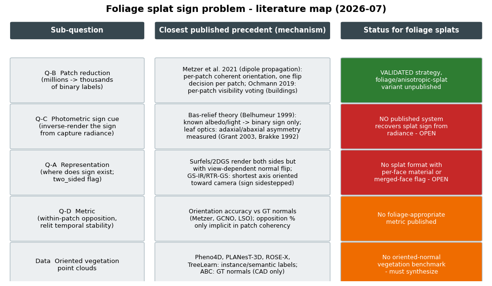

# Normal Orientation (Front/Back Sign) Recovery for Gaussian-Splat Foliage — Research Report

**Date:** 2026-07-17 · **Scope:** patch-based orientation, photometric/appearance-based sign recovery, two-sided splat representations, and oriented-vegetation benchmarks, as posed in the reformulated foliage-sign problem statement.

## TL;DR

- **Q1 (patch-based orientation):** The reduction "millions of per-point unknowns → one binary label per patch" is a *published and validated* strategy — **Metzer et al. 2021** (dipole propagation over coherently-oriented patches) and **Ochmann et al. 2019** (per-patch visibility voting over detected planes) are the two direct precedents  [(NYU Courant)](https://cims.nyu.edu/gcl/papers/2021-Dipole.pdf) . Neither targets foliage-like clouds of open, two-sided sheets, and neither operates on anisotropic *splat* primitives. Adapting the strategy is safe; the patch criterion for anisotropic splats and the two-sided-sheet semantics are the open part.
- **Q2 (photometric sign recovery):** No published work — in splatting, point clouds, photogrammetry, or leaf modeling — uses **per-view radiance asymmetry under known capture illumination to assign front/back (sign) labels** to surface primitives. Identifiability theory (bas-relief ambiguity) says sign *is* recoverable exactly when albedo/lighting knowledge or shadowing/specularity breaks the Lambertian symmetry  [(EECS at UC Berkeley)](https://www2.eecs.berkeley.edu/Research/Projects/CS/vision/classes/cs294-appearance_models/sp2001/cache/belhumeur99.pdf) , and leaf-optics measurements confirm a physical front/back radiance asymmetry exists to exploit  [(usda.gov)](https://research.fs.usda.gov/download/treesearch/7011.pdf) . **The cue appears genuinely unpublished for splats; it is the most novel element of the reformulation.**
- **Q3 (two-sided representations):** Current splat practice *sidesteps* sign rather than representing it: surfels/2DGS discs are visible from both sides, and inverse-rendering splat systems (GS-IR, RTR-GS, R3DG, GaussianShader) define the normal as the shortest axis "oriented toward the viewing direction"  [(arXiv.org)](https://arxiv.org/html/2507.07733v2) . No published splat/surfel format carries per-face materials or an explicit merged-two-face flag. The only honest two-sided thin-surface models live in leaf optics (BRDF+BTDF leaf rendering, PROSPECT/LEAFMOD, multi-dipole thin-slab scattering)  [(Computer Graphics Group)](https://graphics.cs.yale.edu/sites/default/files/leaf2005.pdf) .
- **Data:** No vegetation point-cloud dataset provides oriented normals or front/back ground truth — Pheno4D, PLANesT-3D, ROSE-X, Plant3D, Soybean-MVS, and TreeLearn provide semantic/instance labels only  [(nih.gov)](https://pmc.ncbi.nlm.nih.gov/articles/PMC8372960/) . Oriented-normal benchmarks exist only for CAD (ABC)  [(Computer Graphics at Stanford University)](https://graphics.stanford.edu/courses/cs348n-22-winter/PapersReferenced/ABC%20Data%20Set%201812.06216.pdf) . Ground-truth sign for foliage will have to be **synthesized** (procedural canopies with known leaf orientation).

---

## 1. Q1 — Patch-based orientation: precedents, mechanisms, and the foliage gap

### 1.1 The classical pipeline and where patches first appear

The consistent-orientation problem for point clouds is thirty years old and its classical form is exactly the one the reformulation rejects: propagate a sign across a graph built over samples of an assumed orientable surface. Hoppe et al. introduced the MST-propagation baseline, weighting edges by the unreliability measure `1 − |⟨nᵢ, nⱼ⟩|` and flipping normals during traversal so adjacent normals agree; the method handles open surfaces but fails at sharp creases and accumulates greedy errors  [(Technische Universität Dresden)](https://tu-dresden.de/die_tu_dresden/fakultaeten/fakultaet_informatik/smt/cgv/publikationen/2009/normal_propagation.pdf) . Xie et al. introduced the first **patch-level** thinking: multi-seed propagation that avoids high-curvature regions produces "multiple oriented patches touching each other at sharp edges," which are then consistently oriented in a second phase — an explicit per-patch sign resolution, albeit only across crease boundaries of a single closed object  [(Technische Universität Dresden)](https://tu-dresden.de/die_tu_dresden/fakultaeten/fakultaet_informatik/smt/cgv/publikationen/2009/normal_propagation.pdf) . König and Gumhold improved the flip criterion itself by comparing the complexity of Hermite curves interpolating candidate normal pairs in a reference plane, which specifically targets the **close-sheets** configuration (two nearby parallel surfaces) that also dominates foliage  [(Technische Universität Dresden)](https://tu-dresden.de/die_tu_dresden/fakultaeten/fakultaet_informatik/smt/cgv/publikationen/2009/normal_propagation.pdf) .

A second classical line replaces greedy propagation with global optimization. Schertler et al. reformulated orientation as graph-based energy minimization (a maximum-likelihood problem on an MRF, solved with QPBO), Jakob et al. used edge-collapse operations to approximate a global energy minimum, and the GCNO line of Xu et al. ties orientation to correct winding-number computation — all volumetric in spirit, all assuming a closed orientable manifold  [(uni-bonn.de)](https://cg.cs.uni-bonn.de/backend/v2/files/publications/ochmann-2019-automatic/pdf/Ochmann_2019_Orientation_f2466273c6.pdf) . Recent work continues this line: Gotsman et al. 2024 reduce orientation to a sparse linear system built from TSP-ordered cut-plane contours, and Fu et al. (CVPR 2025) cast it as a least-squares problem; both surveys confirm the taxonomy of propagation / volumetric / learning methods and note persistent failure on thin structures and complex topologies  [(usi.ch)](https://www.inf.usi.ch/hormann/papers/Gotsman.2024.ALM.pdf) . For the foliage problem these global methods are mostly *negative* evidence: their objective (a single inside/outside partition of space) is the ill-posed target the reformulation abandons.

### 1.2 Metzer et al. 2021 — the exact "one binary label per patch" mechanism

The strongest precedent for the proposed patch reduction is **dipole propagation** (Metzer et al., SIGGRAPH 2021), which explicitly splits orientation into a local and a global sub-problem  [(NYU Courant)](https://cims.nyu.edu/gcl/papers/2021-Dipole.pdf) . In the local phase, the cloud is partitioned into non-overlapping patches (cubical voxels; patches under 100 points merged; planar patches filtered out as trivially orientable), and a PointCNN-based ensemble predicts a per-point flip probability so that each patch becomes *coherently* oriented — all normals pointing to one side, with the side itself locally meaningless, exactly as the reformulation states for leaf-face patches  [(NYU Courant)](https://cims.nyu.edu/gcl/papers/2021-Dipole.pdf) . In the global phase, patches are oriented one at a time: starting from the flattest patch, each oriented point contributes an electric dipole along its normal, building a global field; the next patch is chosen by the largest absolute potential energy `V_patch = Σ cᵢ · nᵢ · E` (confidence-weighted), and is flipped if `V_patch < 0` — literally **one binary decision per patch**, made on evidence aggregated from *all previously oriented patches*, not just a spanning-tree parent  [(NYU Courant)](https://cims.nyu.edu/gcl/papers/2021-Dipole.pdf) .

Three properties of this design transfer directly to the foliage setting. First, the dipole field is robust to sparse per-point errors — a few inconsistently oriented points "only degrade the electric potential locally," so propagation does not accumulate catastrophic error the way MST does  [(NYU Courant)](https://cims.nyu.edu/gcl/papers/2021-Dipole.pdf) . Second, the traversal is non-local (it "leaps"), giving each patch decision global context without requiring the patch adjacency graph to be connected — directly answering the reformulation's open question of whether canopy patch graphs are "connected enough": dipole-style global fields do not need graph connectivity at all. Third, the method still ends with one irreducible global sign ambiguity (the whole solution can be flipped given a single correct normal), which in the foliage case dissolves entirely because per-patch sign is the end goal, not a means to a global inside/outside  [(NYU Courant)](https://cims.nyu.edu/gcl/papers/2021-Dipole.pdf) . Known weaknesses also transfer as warnings: evaluations against PGR show the dipole method "separates the point clouds into patches, reducing its robustness when the wrong partition occurs, especially when thin structures exist," and it is parameter-sensitive on complex shapes  [(ORCA)](https://orca.cardiff.ac.uk/id/eprint/159075/1/paper.pdf)  — the patch criterion matters more than the label-propagation rule, which is precisely the reformulation's open question about adjacency + axis parallelism + scale continuity for anisotropic splats.

### 1.3 Ochmann et al. 2019 — per-patch *cue voting* on aggregated evidence

The second direct precedent answers a different piece of the reformulation: how non-geometric cues vote at patch level. Ochmann et al. orient normals in multi-story building-interior scans by first detecting planes (CGAL's implementation of Schnabel's efficient RANSAC), rasterizing each plane's support into a coarse 2D occupancy bitmap whose cells are the **patches**, and then assigning each patch an initial orientation from a *path-traced visibility classification* (interior / exterior / outside surfaces, using higher-order visibility through multiple ray bounces rather than direct scanner visibility alone)  [(uni-bonn.de)](https://cg.cs.uni-bonn.de/backend/v2/files/publications/ochmann-2019-automatic/pdf/Ochmann_2019_Orientation_f2466273c6.pdf) . A voting step then consolidates orientation within each surface, and the per-patch decision is finally broadcast back to the points. This is the published template for "patch-level cues vote on far more evidence per unknown": the cue there is multi-bounce visibility, whereas the reformulation's Q-C cue is photometric — the voting architecture is identical, the evidence source differs. Reported accuracy is ~98% of points correctly oriented on real scans, with runtime dominated by plane detection  [(uni-bonn.de)](https://cg.cs.uni-bonn.de/backend/v2/files/publications/ochmann-2019-automatic/pdf/Ochmann_2019_Orientation_f2466273c6.pdf) .

The camera-visibility cue itself has a much older, simpler form worth noting as the trivial baseline: orienting every normal toward the acquisition viewpoint (`flipNormalTowardsViewpoint` in PCL, `orient_normals_towards_camera_location` in Open3D)  [(Point Cloud Library)](https://pcl.readthedocs.io/projects/tutorials/en/pcl-1.14.1/normal_estimation.html) . For a splat cloud with known training cameras this gives a free, per-splat pseudo-label — the sign of ⟨n, view direction⟩ at capture — which is exactly what a photometric vote would refine from "visible from this side" to "this is the adaxial face."

### 1.4 Segmentation machinery transferable to anisotropic splats

For the patch *criterion* (the genuinely open sub-question), the transferable machinery comes from large-scale point-cloud segmentation rather than from the orientation literature. Landrieu and Simonovsky's **superpoint graphs** partition clouds into geometrically homogeneous elements via the ℓ₀-cut-pursuit minimization of a Potts-style energy over handcrafted local features — linearity, planarity, scattering (the eigenvalue-based dimensionality features), plus verticality — computed on a k-NN adjacency graph  [(CVF Open Access)](https://openaccess.thecvf.com/content_cvpr_2018/papers/Landrieu_Large-Scale_Point_Cloud_CVPR_2018_paper.pdf) . The same framework accepts arbitrary per-point embeddings, so splat-native features (normal/shortest-axis direction, anisotropy ratio, scale) drop in directly; the partition is unsupervised, adaptive to local complexity, and demonstrated on clouds of billions of points, which matches canopy scale  [(CVF Open Access)](https://openaccess.thecvf.com/content_cvpr_2018/papers/Landrieu_Large-Scale_Point_Cloud_CVPR_2018_paper.pdf) . Schnabel's RANSAC primitive detection (used by Ochmann via CGAL) is the alternative when patches should be strictly planar  [(uni-bonn.de)](https://cg.cs.uni-bonn.de/backend/v2/files/publications/ochmann-2019-automatic/pdf/Ochmann_2019_Orientation_f2466273c6.pdf) . For splat clouds specifically, an adjacency notion that respects anisotropy — e.g., Mahalanobis-distance k-NN under each splat's own covariance, or intersection-overlap of 3σ ellipsoids — has no published precedent; this is a real, small, publishable gap sitting underneath Q-B.

### 1.5 Q1 gap summary

Every published patch-based orientation method assumes either a single closed orientable object (Metzer, Xie, Hoppe-lineage, all global methods) or architectural planarity with room-scale inside/outside semantics (Ochmann)  [(NYU Courant)](https://cims.nyu.edu/gcl/papers/2021-Dipole.pdf) . None of them handles a cloud of *open, two-sided, interpenetrating sheets* where ~50% neighbor opposition is the correct answer at sheet interfaces, and none operate on anisotropic Gaussian primitives whose scale may exceed the sheet thickness. The reformulation's Q-B is therefore not "solve orientation" but "port a validated architecture to a domain where its manifold assumption is false" — the dipole field and the cue-voting are reusable as-is; the patch criterion, the two-sided-sheet semantics, and the exclusion of merged-face splats (Q-A's class iii) are the unpublished parts.

---

## 2. Q2 — Photometric / appearance-based orientation

### 2.1 Identifiability theory: when is sign recoverable from radiance at all?

The reformulation asks whether front/back is "statistically identifiable" from per-view radiance plus a capture-time sun estimate. The relevant theory is the **generalized bas-relief (GBR) ambiguity**: under uncalibrated Lambertian photometric stereo, shape is recoverable only up to a 3-parameter linear family, and Belhumeur et al.'s Corollary 4.1 shows that **with known or constant albedo (or known light intensities) the ambiguity collapses to exactly a binary sign** — the classical in/out ambiguity — and that *shadowing resolves it*  [(EECS at UC Berkeley)](https://www2.eecs.berkeley.edu/Research/Projects/CS/vision/classes/cs294-appearance_models/sp2001/cache/belhumeur99.pdf) . Subsequent work showed the remaining sign/GBR ambiguity is broken by essentially any departure from the idealized Lambertian setting: specular highlights (Drbohlav–Šára; Georghiades, via Torrance–Sparrow fitting), interreflections (Chandraker et al. 2005 — interreflections *completely* resolve GBR for nonconvex surfaces, because they are distance-dependent while GBR acts linearly), albedo-entropy priors (Alldrin et al. 2007), and half-vector BRDF symmetry (Wu & Tan 2013)  [(ViGIR-lab)](http://vigir.missouri.edu/~gdesouza/Research/Conference_CDs/IEEE_CVPR_2007/data/papers/0240.pdf) .

Mapped onto the foliage problem, this theory is encouraging in a specific way. A leaf under capture-time sun is *not* a shadowless Lambertian patch: it is translucent (the backlit face radiates transmitted light, a strong non-Lambertian asymmetry), its two faces have measurably different albedo and specular response (Section 2.2), and a canopy is full of cast shadows and inter-leaf interreflections. Every one of those effects is a published ambiguity-breaker  [(EECS at UC Berkeley)](https://www2.eecs.berkeley.edu/Research/Projects/CS/vision/classes/cs294-appearance_models/sp2001/cache/belhumeur99.pdf) . The owner's decompose already recovers an env-SH with a dominant sun lobe, i.e. the "known light intensities/directions" condition of Corollary 4.1 is approximately met — leaving precisely the binary sign as the unknown, which is all Q-C asks for. No published work makes this identifiability argument for foliage splats; the photometric-stereo literature makes it only for opaque objects under controlled varying illumination, not for passive single-illumination outdoor capture.

### 2.2 Leaf optics: the physical asymmetry the cue would exploit is measured

The biological premise of Q-C — leaf tops and undersides differ optically — is not folklore; it is quantified in the leaf-optics literature across several independent measurement programs. Grant et al. measured spectral reflectance of **both adaxial and abaxial surfaces** of 20 urban tree species plus isogenic sorghum wax mutants from 250–700 nm, finding PAR-band reflectance differences between the two faces (mean abaxial–adaxial difference ≈ 0.056 for smooth glabrous species) driven by epicuticular wax structure — filamentous and plate waxes scatter more than smooth cuticles — with trichomes adding further front/back contrast  [(usda.gov)](https://research.fs.usda.gov/download/treesearch/7011.pdf) . Brakke's NASA goniometer measurements (yellow poplar, red maple, red oak) found leaf reflectance carries a significant specular component whose strength is surface-dependent: the heavy wax layer on red oak's *abaxial* side made its abaxial reflectance *more* specular than the adaxial side, and transmitted light scattered most isotropically  [(Science.gov)](https://www.science.gov/topicpages/a/abaxial+leaf+surfaces) . ATR infrared spectroscopy shows adaxial vs. abaxial spectra differ systematically with trichome abundance and wax composition  [(Science.gov)](https://www.science.gov/topicpages/a/abaxial+leaf+surfaces) , and direct wax-load measurements confirm the loads themselves are face-dependent (e.g., 0.14 vs. 0.086 g/m² adaxial/abaxial in sorghum bm-22)  [(Canadian Science Publishing)](https://cdnsciencepub.com/doi/pdf/10.4141/cjps93-070) . Light-grown leaves further increase adaxial PAR reflectance, so the asymmetry co-varies with the same sun exposure the cue relies on  [(nih.gov)](https://pmc.ncbi.nlm.nih.gov/articles/PMC11963476/) .

On the modeling side, PROSPECT — the standard leaf optical-properties model — treats the leaf as a stack of plates and predicts hemispherical **reflectance and transmittance** separately, with R + T + A = 1; transmittance is large enough across the visible and NIR that the backlit face's transmission glow is a first-order radiance term, not a subtlety  [(sites.bu.edu)](https://sites.bu.edu/cliveg/files/2023/10/leaf-optics-jacquemoud-ustin.pdf) . The computer-graphics leaf literature already renders this asymmetry: Wang et al. (SIGGRAPH 2005) evaluate **both a BRDF and a BTDF** at every surface point under a sun + environment decomposition, and Habel et al. compute real-time leaf translucency from Donner–Jensen multi-dipole thin-slab scattering  [(Computer Graphics Group)](https://graphics.cs.yale.edu/sites/default/files/leaf2005.pdf) . In other words: the existence, sign, and approximate magnitude of the per-view radiance asymmetry between leaf faces are established; what does not exist is any work *inverting* that asymmetry into a per-primitive orientation label.

### 2.3 What current splat inverse rendering does instead: sidestep sign

The published splat-relighting systems confirm the reformulation's premise that the field routes around sign rather than recovering it. GS-IR, R3DG, and GaussianShader derive per-Gaussian normals from the **shortest covariance axis** and regularize them against depth-derived pseudo-normals; RTR-GS states the convention explicitly — "we define normals as the shortest axis of each Gaussian, **oriented toward the viewing direction**"  [(arXiv.org)](https://arxiv.org/html/2507.07733v2) . GeoSplatting (ICCV 2025) surveys the same family and criticizes these approximated normals as "spatially inconsistent," fixing them instead by binding Gaussians to an explicit mesh — i.e., importing orientation from a mesh, not recovering it from radiance  [(guanbinli.com)](https://guanbinli.com/papers/GeoSplatting_Towards_Geometry_Guided_Gaussian_Splatting_for_Physically-based_Inverse_Rendering_ICCV_2025_paper.pdf) . Outdoor in-the-wild relighting work inherits the same shortest-axis, camera-facing convention  [(scitepress.org)](https://www.scitepress.org/publishedPapers/2026/143322/pdf/index.html) . Geometry-focused splatting papers likewise treat orientation as a consistency-to-depth problem (normal maps aligned to rendered-depth derivatives, monocular-normal guidance), never as a front/back material question  [(ECVA)](https://www.ecva.net/papers/eccv_2024/papers_ECCV/papers/00274.pdf) . Generalizable-splatting work does document that *unconstrained* photometric supervision leaves splat orientations degenerate — "multiple 3D Gaussian configurations can produce equally valid renderings," with misaligned normals as the visible symptom — which is independent evidence that the capture contains geometric information the image loss alone does not extract  [(arXiv.org)](https://arxiv.org/html/2512.17547v1) .

This camera-facing convention is, in effect, the published version of the owner's D7 sign-agnostic shading: it guarantees a locally sane normal for shading at the cost of never knowing which physical face is which. The consequence the reformulation identifies is visible in these systems' shared blind spot — none of them can shade a leaf differently from above vs. below, because the representation has no notion of "above the leaf" at all.

### 2.4 Novelty verdict for Q2

Combining 2.1–2.3: (a) identifiability of a binary sign from shading under known illumination is established theory with multiple published ambiguity-breaking mechanisms  [(EECS at UC Berkeley)](https://www2.eecs.berkeley.edu/Research/Projects/CS/vision/classes/cs294-appearance_models/sp2001/cache/belhumeur99.pdf) ; (b) the front/back radiance asymmetry of real leaves is measured and modeled in botany and graphics  [(usda.gov)](https://research.fs.usda.gov/download/treesearch/7011.pdf) ; (c) the entire splat literature either ignores sign or hard-codes a view-dependent convention  [(arXiv.org)](https://arxiv.org/html/2507.07733v2) . Searches across splatting, point-cloud orientation, photogrammetry, and vegetation modeling (2026-07-17) surfaced **no published system that recovers per-splat or per-patch front/back labels from capture radiance** — no "inverse rendering of the sign," and not even the problem statement. Closest neighbors and why they are not the claim: photometric stereo varies the light and assumes opaque Lambertian surfaces  [(EECS at UC Berkeley)](https://www2.eecs.berkeley.edu/Research/Projects/CS/vision/classes/cs294-appearance_models/sp2001/cache/belhumeur99.pdf) ; Ochmann's visibility voting uses geometry of ray paths, not radiance values  [(uni-bonn.de)](https://cg.cs.uni-bonn.de/backend/v2/files/publications/ochmann-2019-automatic/pdf/Ochmann_2019_Orientation_f2466273c6.pdf) ; leaf BRDF/BTDF work *renders* the asymmetry from known orientation rather than inferring orientation from it  [(Computer Graphics Group)](https://graphics.cs.yale.edu/sites/default/files/leaf2005.pdf) . **Q-C, as posed, appears to be genuinely unpublished territory**, with the caveat that the adjacent theory is mature enough that a reviewer will expect the identifiability argument (2.1) to be made carefully rather than claimed by intuition.

---

## 3. Q3 — Two-sided splat and surfel representations

### 3.1 Rendering practice: two-sided visibility, single-sided semantics

Point-based and splat representations have always rendered two-sided *visibility* while keeping single-sided *semantics*. Surfels and 2DGS discs are visible from both sides (there is no backface culling of a point or disc in the rasterizer), and when a normal is needed for shading, engines flip it to face the viewer — the classic game-industry two-sided-foliage trick of negating the normal when ⟨n, view⟩ < 0, or equivalently shading with |n·l|  [(Unity Discussions)](https://discussions.unity.com/t/2-sided-normals/381252) . The inverse-rendering splat systems in Section 2.3 institutionalize exactly this trick  [(arXiv.org)](https://arxiv.org/html/2507.07733v2) . This is the key structural observation for Q-A: **the field's answer to two-sidedness is a shading-time hack that discards information**, not a representation. Nothing in the surfel/2DGS/3DGS lineage attaches distinct material state to the two faces of a primitive, and nothing flags a primitive as "thinner than the sheet it approximates."

### 3.2 Where honest two-sided thin-surface models do exist

The representations that *do* model two faces truthfully come from translucency research and leaf optics rather than from the splat literature. Wang et al.'s leaf renderer keeps a per-point BRDF **and** BTDF and evaluates both under direct sun and environment light, so the same geometric surface emits different radiance depending on which face the camera sees  [(Computer Graphics Group)](https://graphics.cs.yale.edu/sites/default/files/leaf2005.pdf) . Habel et al. precompute multi-dipole diffusion profiles for leaves — a thin-slab BSSRDF in which slab *thickness* is an explicit parameter controlling the transmission lobe  [(Research Unit of Computer Graphics | TU Wien)](https://www.cg.tuwien.ac.at/research/publications/2007/Habel_2007_RTT/Habel_2007_RTT-Preprint.pdf) . PROSPECT's plate-stack model parameterizes internal layer count N and predicts R and T separately per face geometry  [(sites.bu.edu)](https://sites.bu.edu/cliveg/files/2023/10/leaf-optics-jacquemoud-ustin.pdf) . These are "thickness-aware, per-face-material" surfaces in everything but name — and they are the natural semantic target for a `two_sided` splat class: a class-(iii) merged-face splat in the reformulation is precisely a thin-slab scatterer, and the leaf-optics literature already supplies its forward model.

### 3.3 Gaussian primitives with real light transport

The closest the splat world comes to a physically two-sided primitive is the recent **Unified Gaussian Primitives** work, which treats Gaussians as volumetric scattering primitives inside a Monte Carlo path tracer with a Disney BSDF (using double-sided GGX microfacet distributions) and derives closed-form ray integrals and transmittance  [(arXiv.org)](https://arxiv.org/html/2406.09733v3) . This gives each primitive genuine two-sided light transport, but as a *volumetric* property of one scattering particle — there is still no per-face albedo and no notion of the primitive's two sides corresponding to two biological surfaces. Meanwhile, two-sidedness is beginning to surface as a named failure mode in splat systems: ActiveGAMER (CVPR 2025) explicitly lists "double-sided objects" as a case its information-gain exploration misses, because reconstructing one side never signals that the back side exists  [(CVF Open Access)](https://openaccess.thecvf.com/content/CVPR2025/papers/Chen_ActiveGAMER_Active_GAussian_Mapping_through_Efficient_Rendering_CVPR_2025_paper.pdf) . That is the merged-face problem appearing in the wild, unnamed as such.

### 3.4 Q3 gap summary

No published splat/surfel format provides (i) per-face materials, (ii) an explicit double-sided/merged-face flag, or (iii) thickness-awareness relative to the sheet being approximated. The schema change proposed in Q-A — splats classified as one-sided / single-face / merged-two-face, with class (iii) carrying a flag instead of a forced sign — has no published counterpart, and its forward-shading model is already waiting in the leaf-optics literature  [(Computer Graphics Group)](https://graphics.cs.yale.edu/sites/default/files/leaf2005.pdf) . The nearest conceptual relatives (double-sided GGX in path-traced Gaussian primitives  [(arXiv.org)](https://arxiv.org/html/2406.09733v3) , engine-side normal flipping  [(Unity Discussions)](https://discussions.unity.com/t/2-sided-normals/381252) ) confirm the gap rather than fill it.

---

## 4. Datasets and benchmarks

### 4.1 What exists

| Dataset | Domain | Labels provided | Orientation GT? |
|---|---|---|---|
| ABC (1M CAD models) | Manufactured solids | GT normals from B-rep, patch segmentation benchmarks | **Yes** (CAD only)  [(Computer Graphics at Stanford University)](https://graphics.stanford.edu/courses/cs348n-22-winter/PapersReferenced/ABC%20Data%20Set%201812.06216.pdf)  |
| Pheno4D | 7 maize + 7 tomato, laser-scanned daily | Per-point leaf instance + organ, temporally consistent | No  [(nih.gov)](https://pmc.ncbi.nlm.nih.gov/articles/PMC8372960/)  |
| PLANesT-3D | 34 plant models (3 species) | Organ + leaf-instance labels; color | No  [(arXiv.org)](https://arxiv.org/html/2407.21150v1)  |
| Plant3D | 714 scans (tomato/tobacco/sorghum/arabidopsis) | Stem/lamina on subsets | No  [(arXiv.org)](https://arxiv.org/html/2407.21150v1)  |
| ROSE-X | 11 rosebushes, X-ray CT | Voxel labels leaf/stem/flower | No  [(arXiv.org)](https://arxiv.org/html/2407.21150v1)  |
| Soybean-MVS | 102 MVS reconstructions | Growth-stage series | No  [(arXiv.org)](https://arxiv.org/html/2407.21150v1)  |
| TreeLearn benchmark | Forest MLS plots (beech, leafless) | Tree instance segmentation | No  [(arXiv.org)](https://arxiv.org/abs/2309.08471)  |

Orientation ground truth exists only where orientation is manufactured: CAD datasets like ABC, whose parametric B-reps yield exact normals and which hosted the standard normal-estimation benchmarks  [(Computer Graphics at Stanford University)](https://graphics.stanford.edu/courses/cs348n-22-winter/PapersReferenced/ABC%20Data%20Set%201812.06216.pdf) . Vegetation datasets label *what* each point is (leaf instance, organ) but never *which way the leaf faces* — consistent with the fact that even defining that label requires the classifier proposed in Q-A. Laser-scanned plant clouds also typically lack the aligned multi-view radiance imagery a photometric cue needs, which rules them out as Q-C testbeds even with manual sign annotation.

### 4.2 Implication: ground truth must be synthesized

For validation of any Q-A/Q-B/Q-C prototype, the practical route is a **synthetic canopy**: a procedural or authored plant model with known per-face orientation (any mesh asset carries true front/back), rendered to multi-view images under a known sun, then reconstructed with the owner's own splat pipeline. The reconstruction inherits GT sign by nearest-splat transfer from the source mesh, giving exact per-splat and per-patch labels plus a known illumination estimate — everything the Q-D metric and the M-C photometric-vote prototype need, with none of the annotation ambiguity of real scans. Real vegetation datasets (Pheno4D, PLANesT-3D) remain useful as geometric priors for canopy structure and patch-graph statistics  [(nih.gov)](https://pmc.ncbi.nlm.nih.gov/articles/PMC8372960/) , and plant-targeted 3DGS reconstruction work (strawberry, cotton, forest stands) confirms splat pipelines behave on plant geometry, though none of it addresses orientation  [(arXiv.org)](https://arxiv.org/html/2511.02207v1) .

---

## 5. Synthesis against the proposed milestones

The literature position maps cleanly onto the owner's four milestones, and in one case reorders their risk profile. **M-A (two-sided classifier + schema flag)** has no published precedent and no blocking dependency — thin-structure fragility reports in the orientation literature  [(ORCA)](https://orca.cardiff.ac.uk/id/eprint/159075/1/paper.pdf)  and the thickness-parameterized leaf-scattering models  [(Research Unit of Computer Graphics | TU Wien)](https://www.cg.tuwien.ac.at/research/publications/2007/Habel_2007_RTT/Habel_2007_RTT-Preprint.pdf)  both support the s_min-vs-sheet-threshold design; it stays cheap and honest as planned. **M-B (patch segmentation + within-patch consistency + metric)** can stand almost entirely on published machinery: superpoint-style ℓ₀ partitions with splat-native anisotropic features for segmentation  [(CVF Open Access)](https://openaccess.thecvf.com/content_cvpr_2018/papers/Landrieu_Large-Scale_Point_Cloud_CVPR_2018_paper.pdf) , dipole-style per-patch binary decisions for consistency  [(NYU Courant)](https://cims.nyu.edu/gcl/papers/2021-Dipole.pdf) , with the novel work concentrated in the anisotropic-adjacency definition and the two-sided-aware metric (Q-D) — no published metric handles a cloud where ~50% boundary opposition is correct.

**M-C (photometric sign vote)** is the highest-novelty and highest-risk item: the cue's physics is measured (2.2) and its identifiability is backed by GBR theory under the owner's known-sun condition (2.1), but nobody has demonstrated the inversion on any representation, so a negative or weak result here is itself publishable information. The sensible prototype shape follows Ochmann's architecture — aggregate per-view radiance residuals per patch, vote once per patch — with the camera-facing pseudo-label (⟨n, view⟩) as the free baseline to beat  [(uni-bonn.de)](https://cg.cs.uni-bonn.de/backend/v2/files/publications/ochmann-2019-automatic/pdf/Ochmann_2019_Orientation_f2466273c6.pdf) . **M-D (A/B vs. sign-agnostic runtime)** has a built-in published baseline: the shortest-axis-toward-camera convention of GS-IR/RTR-GS *is* the sign-agnostic strategy, so the experiment compares the owner's runtime against both an internal baseline and the de facto state of the art  [(arXiv.org)](https://arxiv.org/html/2507.07733v2) . The capability gap to measure is exactly the one those systems cannot express: transmission asymmetry under relighting, which requires true per-face identity  [(Computer Graphics Group)](https://graphics.cs.yale.edu/sites/default/files/leaf2005.pdf) .

### Consolidated precedent table

| Sub-question | Closest published precedent | Exact mechanism | Why it is not the claim |
|---|---|---|---|
| Q-B patch reduction | Metzer et al. 2021  [(NYU Courant)](https://cims.nyu.edu/gcl/papers/2021-Dipole.pdf)  | Neural per-patch coherent orientation + dipole-field per-patch binary flip | Closed single objects; point clouds, not anisotropic splats; patch criterion naive (voxels) |
| Q-B cue voting | Ochmann et al. 2019  [(uni-bonn.de)](https://cg.cs.uni-bonn.de/backend/v2/files/publications/ochmann-2019-automatic/pdf/Ochmann_2019_Orientation_f2466273c6.pdf)  | RANSAC planes → occupancy patches → path-traced visibility class → per-surface vote | Architectural planes; visibility cue, not radiance; inside/outside semantics |
| Q-B segmentation | Landrieu & Simonovsky 2018  [(CVF Open Access)](https://openaccess.thecvf.com/content_cvpr_2018/papers/Landrieu_Large-Scale_Point_Cloud_CVPR_2018_paper.pdf)  | ℓ₀-cut-pursuit partition on planarity/linearity/scattering features | Designed for LiDAR semantics, not orientation or splats |
| Q-C identifiability | Belhumeur 1999; Chandraker 2005  [(EECS at UC Berkeley)](https://www2.eecs.berkeley.edu/Research/Projects/CS/vision/classes/cs294-appearance_models/sp2001/cache/belhumeur99.pdf)  | Known albedo/light → binary-sign-only ambiguity; shadows/interreflections resolve it | Opaque Lambertian objects, controlled lights; never applied to foliage or splats |
| Q-C cue physics | Grant 2003; Brakke 1992  [(usda.gov)](https://research.fs.usda.gov/download/treesearch/7011.pdf)  | Measured adaxial/abaxial reflectance & specular differences (wax, trichomes) | Measurement, not inference; no 3D orientation recovery |
| Q-C current practice | GS-IR / RTR-GS / GaussianShader  [(arXiv.org)](https://arxiv.org/html/2507.07733v2)  | Normal = shortest axis, flipped toward camera at shading | Discards sign deliberately; cannot shade faces asymmetrically |
| Q-A/Q3 two-sided model | Wang 2005; Habel 2007; PROSPECT  [(Computer Graphics Group)](https://graphics.cs.yale.edu/sites/default/files/leaf2005.pdf)  | Per-point BRDF+BTDF; thin-slab multi-dipole; plate-stack R/T | Forward models with known orientation; mesh optics, not splat schema |
| Q3 nearest splat format | Unified Gaussian Primitives 2024  [(arXiv.org)](https://arxiv.org/html/2406.09733v3)  | Volumetric Gaussian + Disney BSDF in path tracer | Two-sided transport per particle; still no per-face materials or merged-face flag |
| Data | ABC; Pheno4D; PLANesT-3D  [(Computer Graphics at Stanford University)](https://graphics.stanford.edu/courses/cs348n-22-winter/PapersReferenced/ABC%20Data%20Set%201812.06216.pdf)  | CAD GT normals; plant instance/organ labels | No oriented-vegetation ground truth exists; synthesis required |

---

 [(Technische Universität Dresden)](https://tu-dresden.de/die_tu_dresden/fakultaeten/fakultaet_informatik/smt/cgv/publikationen/2009/normal_propagation.pdf) : https://tu-dresden.de/die_tu_dresden/fakultaeten/fakultaet_informatik/smt/cgv/publikationen/2009/normal_propagation.pdf
 [(uni-bonn.de)](https://cg.cs.uni-bonn.de/backend/v2/files/publications/ochmann-2019-automatic/pdf/Ochmann_2019_Orientation_f2466273c6.pdf) : https://cg.cs.uni-bonn.de/backend/v2/files/publications/ochmann-2019-automatic/pdf/Ochmann_2019_Orientation_f2466273c6.pdf
 [(usi.ch)](https://www.inf.usi.ch/hormann/papers/Gotsman.2024.ALM.pdf) : https://www.inf.usi.ch/hormann/papers/Gotsman.2024.ALM.pdf
 [(CVF Open Access)](https://openaccess.thecvf.com/content/CVPR2025/papers/Fu_Consistent_Normal_Orientation_for_3D_Point_Clouds_via_Least_Squares_CVPR_2025_paper.pdf) : https://openaccess.thecvf.com/content/CVPR2025/papers/Fu_Consistent_Normal_Orientation_for_3D_Point_Clouds_via_Least_Squares_CVPR_2025_paper.pdf
 [(ECVA)](https://www.ecva.net/papers/eccv_2024/papers_ECCV/papers/00274.pdf) : https://www.ecva.net/papers/eccv_2024/papers_ECCV/papers/00274.pdf
 [(arXiv.org)](https://arxiv.org/html/2512.17547v1) : https://arxiv.org/html/2512.17547v1
 [(OpenReview)](https://openreview.net/pdf?id=ZfNeovqQkn) : https://openreview.net/pdf?id=ZfNeovqQkn
 [(NYU Courant)](https://cims.nyu.edu/gcl/papers/2021-Dipole.pdf) : https://cims.nyu.edu/gcl/papers/2021-Dipole.pdf
 [(galmetzer.github.io)](https://galmetzer.github.io/dipole-normal-prop/) : https://galmetzer.github.io/dipole-normal-prop/
 [(ORCA)](https://orca.cardiff.ac.uk/id/eprint/159075/1/paper.pdf) : https://orca.cardiff.ac.uk/id/eprint/159075/1/paper.pdf
 [(arXiv.org)](https://arxiv.org/abs/2105.01604) : https://arxiv.org/abs/2105.01604
 [(Github)](https://github.com/galmetzer/dipole-normal-prop) : https://github.com/galmetzer/dipole-normal-prop
 [(arXiv.org)](https://arxiv.org/html/2407.21150v1) : https://arxiv.org/html/2407.21150v1
 [(jgomezdans.github.io)](http://jgomezdans.github.io/barrax_2015/leaf_optics.html) : http://jgomezdans.github.io/barrax_2015/leaf_optics.html
 [(sites.bu.edu)](https://sites.bu.edu/cliveg/files/2023/10/leaf-optics-jacquemoud-ustin.pdf) : https://sites.bu.edu/cliveg/files/2023/10/leaf-optics-jacquemoud-ustin.pdf
 [(nih.gov)](https://pmc.ncbi.nlm.nih.gov/articles/PMC8372960/) : https://pmc.ncbi.nlm.nih.gov/articles/PMC8372960/
 [(IPGP)](https://www.ipgp.fr/~jacquemoud/publications/feret2008.pdf) : https://www.ipgp.fr/~jacquemoud/publications/feret2008.pdf
 [(Medium)](https://medium.com/@sergio.deleon_41219/2d-gaussian-splatting-from-pixels-to-geometry-part-1-b08763fbfefe) : https://medium.com/@sergio.deleon_41219/2d-gaussian-splatting-from-pixels-to-geometry-part-1-b08763fbfefe
 [(LearnOpenCV)](https://learnopencv.com/2d-gaussian-splatting-2dgs/) : https://learnopencv.com/2d-gaussian-splatting-2dgs/
 [(usda.gov)](https://research.fs.usda.gov/download/treesearch/7011.pdf) : https://research.fs.usda.gov/download/treesearch/7011.pdf
 [(nih.gov)](https://pmc.ncbi.nlm.nih.gov/articles/PMC11963476/) : https://pmc.ncbi.nlm.nih.gov/articles/PMC11963476/
 [(Canadian Science Publishing)](https://cdnsciencepub.com/doi/pdf/10.4141/cjps93-070) : https://cdnsciencepub.com/doi/pdf/10.4141/cjps93-070
 [(scitepress.org)](https://www.scitepress.org/publishedPapers/2026/143322/pdf/index.html) : https://www.scitepress.org/publishedPapers/2026/143322/pdf/index.html
 [(Science.gov)](https://www.science.gov/topicpages/a/abaxial+leaf+surfaces) : https://www.science.gov/topicpages/a/abaxial+leaf+surfaces
 [(ScienceDirect)](https://www.sciencedirect.com/science/article/abs/pii/S0168192303001904) : https://www.sciencedirect.com/science/article/abs/pii/S0168192303001904
 [(arXiv.org)](https://arxiv.org/html/2507.07733v2) : https://arxiv.org/html/2507.07733v2
 [(EECS at UC Berkeley)](https://www2.eecs.berkeley.edu/Research/Projects/CS/vision/classes/cs294-appearance_models/sp2001/cache/belhumeur99.pdf) : https://www2.eecs.berkeley.edu/Research/Projects/CS/vision/classes/cs294-appearance_models/sp2001/cache/belhumeur99.pdf
 [(ViGIR-lab)](http://vigir.missouri.edu/~gdesouza/Research/Conference_CDs/IEEE_CVPR_2007/data/papers/0240.pdf) : http://vigir.missouri.edu/~gdesouza/Research/Conference_CDs/IEEE_CVPR_2007/data/papers/0240.pdf
 [(CVF Open Access)](https://openaccess.thecvf.com/content_cvpr_2013/papers/Wu_Calibrating_Photometric_Stereo_2013_CVPR_paper.pdf) : https://openaccess.thecvf.com/content_cvpr_2013/papers/Wu_Calibrating_Photometric_Stereo_2013_CVPR_paper.pdf
 [(guanbinli.com)](https://guanbinli.com/papers/GeoSplatting_Towards_Geometry_Guided_Gaussian_Splatting_for_Physically-based_Inverse_Rendering_ICCV_2025_paper.pdf) : https://guanbinli.com/papers/GeoSplatting_Towards_Geometry_Guided_Gaussian_Splatting_for_Physically-based_Inverse_Rendering_ICCV_2025_paper.pdf
 [(ucsd.edu)](https://cseweb.ucsd.edu/~mkchandraker/pdf/cvpr05_gbr.pdf) : https://cseweb.ucsd.edu/~mkchandraker/pdf/cvpr05_gbr.pdf
 [(3DGS Viewer)](https://www.3dgsviewers.com/learn/guide/papers/gaussianshader) : https://www.3dgsviewers.com/learn/guide/papers/gaussianshader
 [(arXiv.org)](https://arxiv.org/html/2511.02207v1) : https://arxiv.org/html/2511.02207v1
 [(CVF Open Access)](https://openaccess.thecvf.com/content_cvpr_2018/papers/Landrieu_Large-Scale_Point_Cloud_CVPR_2018_paper.pdf) : https://openaccess.thecvf.com/content_cvpr_2018/papers/Landrieu_Large-Scale_Point_Cloud_CVPR_2018_paper.pdf
 [(arXiv.org)](https://arxiv.org/abs/1711.09869) : https://arxiv.org/abs/1711.09869
 [(MDPI)](https://www.mdpi.com/2072-4292/17/9/1520) : https://www.mdpi.com/2072-4292/17/9/1520
 [(sciopen.com)](https://www.sciopen.com/local/article_pdf/10.1016/j.cj.2025.01.011.pdf) : https://www.sciopen.com/local/article_pdf/10.1016/j.cj.2025.01.011.pdf
 [(Computer Graphics at Stanford University)](https://graphics.stanford.edu/courses/cs348n-22-winter/PapersReferenced/ABC%20Data%20Set%201812.06216.pdf) : https://graphics.stanford.edu/courses/cs348n-22-winter/PapersReferenced/ABC%20Data%20Set%201812.06216.pdf
 [(deep-geometry.github.io)](https://deep-geometry.github.io/abc-dataset/) : https://deep-geometry.github.io/abc-dataset/
 [(arXiv.org)](https://arxiv.org/abs/2309.08471) : https://arxiv.org/abs/2309.08471
 [(arXiv.org)](https://arxiv.org/html/2309.08471v2) : https://arxiv.org/html/2309.08471v2
 [(Research Unit of Computer Graphics | TU Wien)](https://www.cg.tuwien.ac.at/research/publications/2007/Habel_2007_RTT/Habel_2007_RTT-Preprint.pdf) : https://www.cg.tuwien.ac.at/research/publications/2007/Habel_2007_RTT/Habel_2007_RTT-Preprint.pdf
 [(Computer Graphics Group)](https://graphics.cs.yale.edu/sites/default/files/leaf2005.pdf) : https://graphics.cs.yale.edu/sites/default/files/leaf2005.pdf
 [(Point Cloud Library)](https://pcl.readthedocs.io/projects/tutorials/en/pcl-1.14.1/normal_estimation.html) : https://pcl.readthedocs.io/projects/tutorials/en/pcl-1.14.1/normal_estimation.html
 [(Open3D)](https://www.open3d.org/docs/0.6.0/python_api/open3d.geometry.orient_normals_towards_camera_location.html) : https://www.open3d.org/docs/0.6.0/python_api/open3d.geometry.orient_normals_towards_camera_location.html
 [(arXiv.org)](https://arxiv.org/html/2406.09733v3) : https://arxiv.org/html/2406.09733v3
 [(CVF Open Access)](https://openaccess.thecvf.com/content/CVPR2025/papers/Chen_ActiveGAMER_Active_GAussian_Mapping_through_Efficient_Rendering_CVPR_2025_paper.pdf) : https://openaccess.thecvf.com/content/CVPR2025/papers/Chen_ActiveGAMER_Active_GAussian_Mapping_through_Efficient_Rendering_CVPR_2025_paper.pdf
 [(Unity Discussions)](https://discussions.unity.com/t/2-sided-normals/381252) : https://discussions.unity.com/t/2-sided-normals/381252
